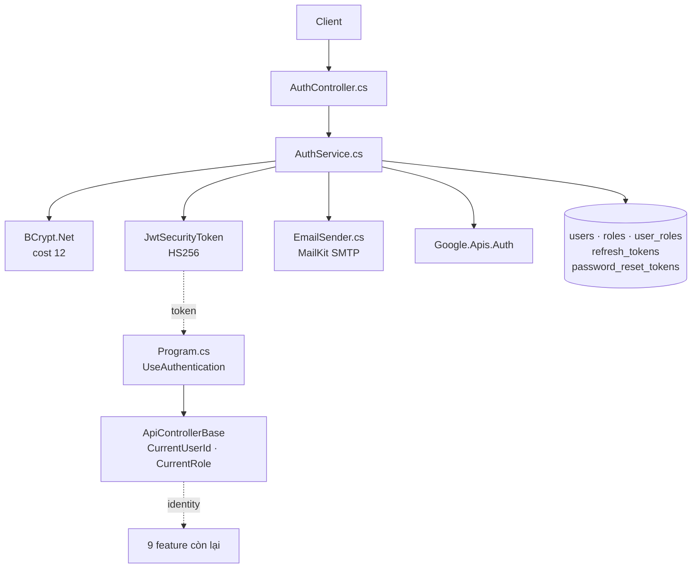
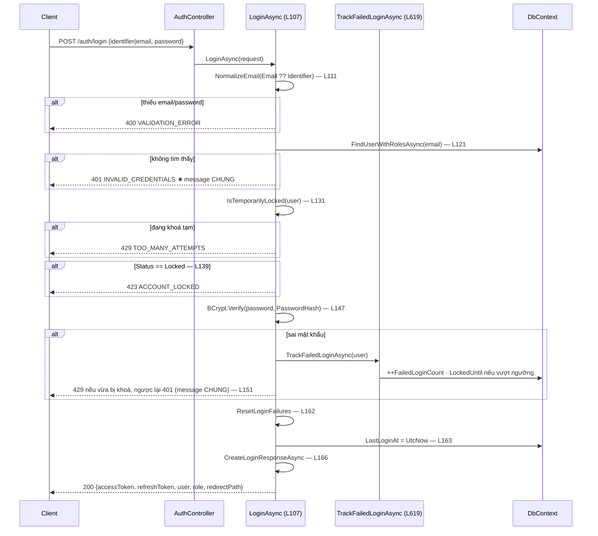

# Phân tích luồng: Authentication & RBAC (spec 001)

**Ngày phân tích:** 2026-07-23 · **Nguồn:** đọc trực tiếp `Features/Auth/AuthService.cs` (~760 dòng)
**Spec:** [001-auth-rbac](../../03-Interface-Specs/feature-specs/001-auth-rbac/spec.md) · [plan](../../03-Interface-Specs/feature-specs/001-auth-rbac/plan.md)

> Feature nền tảng: **9/10 feature còn lại** phụ thuộc identity và role lấy từ đây.

---

## 1. Tóm tắt

9 endpoint dưới `/api/v1/auth`. Toàn bộ nghiệp vụ nằm trong **một** service (`AuthService.cs`) vì các luồng dùng chung state khoá tài khoản và cùng một hàm phát hành token.

Điểm ra của feature không phải response, mà là **JWT claim** — mọi controller khác đọc identity qua `ApiControllerBase` chứ không gọi lại `AuthService`.

## 2. Bản đồ cấu trúc

| File | Vai trò | Loại |
|---|---|---|
| [`AuthController.cs`](../../../backend/GymMaster.API/Features/Auth/AuthController.cs) | 9 action, `[AllowAnonymous]` cho endpoint công khai | Controller |
| [`AuthService.cs`](../../../backend/GymMaster.API/Features/Auth/AuthService.cs) | Hash · JWT · khoá tài khoản · OTP · Google | Service |
| [`ApiControllerBase.cs`](../../../backend/GymMaster.API/Common/ApiControllerBase.cs) | `CurrentUserId` / `CurrentRole` — **cửa vào của 9 feature khác** | Common |
| [`User.cs`](../../../backend/GymMaster.API/Entities/User.cs) | + `FailedLoginCount` · `LoginWindowStartedAt` · `LockedUntil` | Entity |
| [`RefreshToken.cs`](../../../backend/GymMaster.API/Entities/RefreshToken.cs) · [`PasswordResetToken.cs`](../../../backend/GymMaster.API/Entities/PasswordResetToken.cs) | Lưu **hash** của token/OTP | Entity |
| [`EmailSender.cs`](../../../backend/GymMaster.API/Infrastructure/EmailSender.cs) | Gửi OTP qua MailKit SMTP | Infrastructure |
| [`Program.cs`](../../../backend/GymMaster.API/Program.cs) | `AddJwtBearer`, `ClockSkew = TimeSpan.Zero` | Startup |

### Hàm chính

| Dòng | Hàm | | Dòng | Hàm |
|---|---|---|---|---|
| 48 | `RegisterAsync` | | 424 | `GoogleLoginAsync` |
| 107 | `LoginAsync` | | 505 | `GetCurrentUserAsync` |
| 169 | `RefreshAsync` | | 531 | `LogoutAsync` |
| 203 | `ForgotPasswordAsync` | | 560 | `CreateLoginResponseAsync` |
| 298 | `ResetPasswordAsync` | | 591 | `CreateAccessToken` |
| 376 | `ChangePasswordAsync` | | 619 | `TrackFailedLoginAsync` |

Hằng số chống brute-force — **L21–22**:
```csharp
private static readonly TimeSpan FailedAttemptWindow   = TimeSpan.FromMinutes(15);
private static readonly TimeSpan TemporaryLockDuration = TimeSpan.FromMinutes(15);
```

## 3. Bản đồ kết nối



| Từ | Đến | Cách | Dữ liệu |
|---|---|---|---|
| `AuthController` | `AuthService` | gọi method | request DTO |
| `AuthService` | `DbContext` | LINQ | `User` + `Roles` |
| `AuthService` | `EmailSender` | `IEmailSender` | email + OTP |
| `Program.cs` | mọi controller | middleware | `ClaimsPrincipal` |
| `ApiControllerBase` | 9 feature khác | property | `userId`, `role` |

## 4. Luồng đăng nhập

`POST /api/v1/auth/login` → `LoginAsync` (**L107**)



## 5. Vai trò từng đoạn code quyết định

### 5.1. Cửa sổ trượt chống brute-force

`AuthService.cs` **L619–641**

```csharp
var now = DateTime.UtcNow;

if (user.LoginWindowStartedAt is null ||
    now - user.LoginWindowStartedAt > FailedAttemptWindow)   // cửa sổ cũ hết hạn
{
    user.LoginWindowStartedAt = now;      // ★ mở cửa sổ MỚI
    user.FailedLoginCount = 1;            //    đếm lại từ 1
}
else
{
    user.FailedLoginCount++;              // vẫn trong cửa sổ 15 phút
}

if (user.FailedLoginCount > MaxFailedAttempts)
{
    user.LockedUntil = now.Add(TemporaryLockDuration);       // khoá tạm 15 phút
}
```

**Điểm tinh tế:** đây là **cửa sổ trượt theo lần sai đầu tiên**, không phải bộ đếm tích luỹ. Sai 3 lần rồi nghỉ 20 phút thì bộ đếm về 0 — người dùng thật gõ nhầm rải rác sẽ không bao giờ bị khoá, trong khi kẻ dò mật khẩu liên tục thì bị chặn. Trạng thái lưu **trên bảng `users`**, không dùng cache — nên restart container không mất (D-007).

### 5.2. Chống user enumeration

Cả hai nhánh ở **L123–129** (email không tồn tại) và **L156–159** (sai mật khẩu) đều trả **cùng một** hằng số:

```csharp
return Failure<AuthLoginResponse>("INVALID_CREDENTIALS", InvalidCredentialsMessage, StatusCodes.Status401Unauthorized);
```

Nếu hai nhánh trả message khác nhau, kẻ tấn công dò được **email nào có trong hệ thống** chỉ bằng cách thử đăng nhập — rò rỉ danh sách khách hàng.

### 5.3. Thứ tự kiểm tra khoá — trước cả BCrypt

`L131` (khoá tạm) và `L139` (khoá vĩnh viễn) đứng **trước** `L147` (`BCrypt.Verify`). Có chủ ý: BCrypt cost 12 tốn ~250ms mỗi lần gọi. Kiểm trạng thái khoá trước nghĩa là request vào tài khoản đang bị khoá **không tiêu CPU** — nếu không, chính cơ chế chống brute-force lại trở thành đường tấn công cạn CPU.

### 5.4. Nhánh 429 sau khi sai mật khẩu

`AuthService.cs` **L151–159**

```csharp
return user.LockedUntil is not null && user.LockedUntil > DateTime.UtcNow
    ? Failure<AuthLoginResponse>("TOO_MANY_ATTEMPTS", "...", StatusCodes.Status429TooManyRequests)
    : Failure<AuthLoginResponse>("INVALID_CREDENTIALS", InvalidCredentialsMessage, StatusCodes.Status401Unauthorized);
```

Lần sai **thứ 6** trả `429` chứ không phải `401` — vì `TrackFailedLoginAsync` vừa đặt `LockedUntil` ngay trước đó. Người dùng biết mình bị khoá thay vì cứ thử tiếp vô ích.

## 6. Dữ liệu di chuyển như thế nào

Theo dõi **mật khẩu** người dùng nhập:

| Bước | Dạng | Nơi tồn tại |
|---|---|---|
| Client nhập | plaintext | HTTPS body |
| `LoginRequest.Password` | plaintext | **chỉ trong bộ nhớ** |
| `BCrypt.Verify` (L147) | so với hash | không ghi log (SAFE-02) |
| Khi đăng ký (L48) | `BCrypt.HashPassword(cost 12)` | `users.PasswordHash` |
| **Không bao giờ** | | log · audit metadata · response |

Và **refresh token**:

| Bước | Dạng |
|---|---|
| Phát hành (L560) | chuỗi ngẫu nhiên trả cho client |
| Lưu DB | **BCrypt hash** vào `refresh_tokens.TokenHash` |
| Refresh (L169) | verify hash → revoke token cũ → cấp token mới (**rotate**) |
| Logout (L531) | set `RevokedAt` cho mọi token còn hiệu lực |

Rò rỉ bảng `refresh_tokens` **không** cho phép chiếm quyền tài khoản (D-004).

## 7. Bảng tra cứu

| Bước | Hàm | Dòng | Mã lỗi |
|---|---|---|---|
| Đăng ký | `RegisterAsync` | 48 | 409 `EMAIL_EXISTS` / `PHONE_EXISTS` |
| Đăng nhập | `LoginAsync` | 107 | 400 · 401 · 423 · 429 |
| Đếm sai | `TrackFailedLoginAsync` | 619 | — |
| Kiểm khoá tạm | `IsTemporarilyLocked` | 650 | — |
| Reset bộ đếm | `ResetLoginFailures` | 643 | — |
| Refresh (rotate) | `RefreshAsync` | 169 | 401 `INVALID_REFRESH_TOKEN` |
| Quên mật khẩu | `ForgotPasswordAsync` | 203 | luôn 200 (không lộ email) |
| Gửi OTP | `SendResetEmailAsync` | 277 | im lặng nếu chưa cấu hình SMTP |
| Đặt lại mật khẩu | `ResetPasswordAsync` | 298 | 401 `INVALID_RESET_TOKEN` / `TOO_MANY_ATTEMPTS` |
| Đổi mật khẩu | `ChangePasswordAsync` | 376 | 401 `INVALID_CURRENT_PASSWORD` |
| Google | `GoogleLoginAsync` | 424 | 400 · 500 `GOOGLE_NOT_CONFIGURED` |
| Đăng xuất | `LogoutAsync` | 531 | 204 |
| Phát hành token | `CreateAccessToken` | 591 | — |

## 8. Phát hiện khi phân tích

> ⚠️ **`AuthService` là service duy nhất trong 14 service nghiệp vụ không có unit test.**
>
> Cơ chế cửa sổ trượt (§5.1) có nhiều nhánh biên — cửa sổ hết hạn, đúng ngưỡng, vượt ngưỡng — mà hiện chỉ được phủ ở mức black-box qua HTTP. Đây là feature nhạy cảm nhất mà lại ít được bảo vệ nhất.
> → việc **B-03** (P1) trong [BACKLOG](../../03-Interface-Specs/feature-specs/BACKLOG.md).

> ℹ️ **Không ghi AuditLog cho login/logout/refresh** — có chủ ý, để `audit_logs` không bị nhiễu và dashboard (spec 008) dùng được. Ghi rõ ở [`001-auth-rbac/plan.md`](../../03-Interface-Specs/feature-specs/001-auth-rbac/plan.md) §8.

## 9. Mục cần bổ sung context

- `GoogleLoginAsync` (L424–504) chưa phân tích chi tiết — phụ thuộc `Google.Apis.Auth`, không kiểm chứng tự động được nếu không có ID token thật.
- `CreateAccessToken` (L591) chọn HS256; **lý do chọn HS256 thay vì RS256 chưa có trong `decision-log.md`** — việc B-15.
