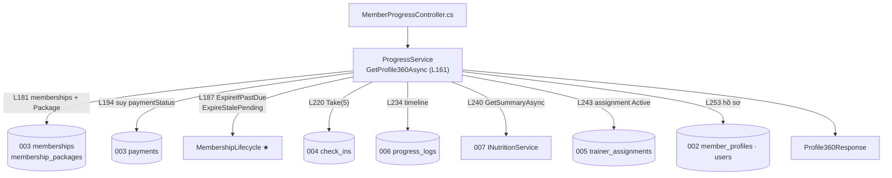
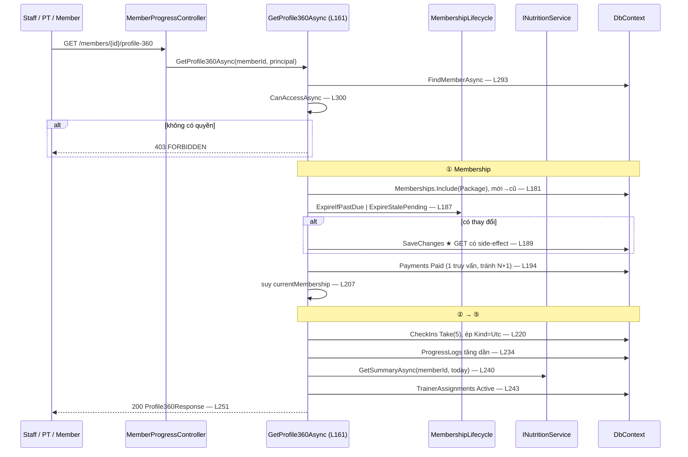

# Phân tích luồng: Member 360° (spec 006)

**Ngày phân tích:** 2026-07-23 · **Nguồn:** đọc trực tiếp `Features/Training/ProgressService.cs`
**Spec:** [006-progress-tracking](../../03-Interface-Specs/feature-specs/006-progress-tracking/spec.md) · [plan](../../03-Interface-Specs/feature-specs/006-progress-tracking/plan.md)

> **Điểm tích hợp lớn nhất hệ thống** — một request gom dữ liệu từ **5 spec khác**. Sửa contract ở bất kỳ spec nào trong đó đều có thể làm hỏng màn hình này.

---

## 1. Tóm tắt

Một endpoint gom toàn bộ thông tin hội viên cho Staff/PT ra quyết định: hồ sơ + gói tập (hiện tại & lịch sử) + check-in gần đây + tiến độ + dinh dưỡng hôm nay + PT đang kèm.

Là **read-model tính lúc gọi**, không có bảng riêng, không cache (GBL-09). Ba route cùng gọi **một** hàm `GetProfile360Async` (**L161**) — nếu tách sẽ có 3 phiên bản dữ liệu lệch nhau.

## 2. Bản đồ cấu trúc

| File | Vai trò | Loại |
|---|---|---|
| [`MemberProgressController.cs`](../../../backend/GymMaster.API/Features/Training/MemberProgressController.cs) | 3 route 360 + 2 route tiến độ | Controller |
| [`ProgressService.cs`](../../../backend/GymMaster.API/Features/Training/ProgressService.cs) | Ghi/đọc tiến độ **và** tổng hợp 360° | Service |
| [`ProgressDtos.cs`](../../../backend/GymMaster.API/Features/Training/ProgressDtos.cs) | `Profile360Response`, `Membership360`, `CheckIn360`, `AssignedPt360` | DTO |
| [`ProgressLog.cs`](../../../backend/GymMaster.API/Entities/ProgressLog.cs) | Entity duy nhất feature **sở hữu** | Entity |

Các hàm: `RecordAsync` L31 · `GetTimelineAsync` L128 · **`GetProfile360Async` L161** · `ToMembership360` L280 · `CanAccessAsync` L300.

## 3. Bản đồ kết nối — 6 nguồn dữ liệu



| Từ | Đến | Cách | Dữ liệu |
|---|---|---|---|
| `ProgressService` | `MembershipLifecycle` | hàm static | đồng bộ trạng thái **trước** khi trả |
| `ProgressService` | `INutritionService` | **inject service** (duy nhất) | `CalorieSummaryResponse` |
| `ProgressService` | `DbContext` | LINQ đọc bảng của 4 slice khác | entity |

> Đây là chỗ **duy nhất** một slice inject Service của slice khác (`INutritionService`). Chấp nhận vì công thức calo phải là một nguồn — tự tính lại sẽ ra số khác spec 007.

## 4. Luồng tổng hợp



## 5. Vai trò từng đoạn code quyết định

### 5.1. Đồng bộ trạng thái **trước** khi trả — GET có side-effect

`ProgressService.cs` **L187–190**

```csharp
if (MembershipLifecycle.ExpireIfPastDue(memberships, today) | MembershipLifecycle.ExpireStalePending(memberships))
{
    await _dbContext.SaveChangesAsync(cancellationToken);
}
```

Chú ý toán tử **`|` (single pipe), không phải `||`**. Đây là chi tiết dễ sửa sai nhất file: `||` sẽ **short-circuit** — nếu `ExpireIfPastDue` trả `true` thì `ExpireStalePending` **không bao giờ chạy**, và các đơn Pending quá 30 phút sẽ không bị huỷ. Dùng `|` để **cả hai** đều thực thi rồi mới OR kết quả.

Đây cũng là chỗ endpoint GET ghi DB — lệch nguyên tắc "GET không side-effect", chấp nhận vì Cloud Run scale-to-zero không chạy được background job (GBL-10). Không làm thì 360° hiển thị gói `Active` đã quá hạn.

### 5.2. Suy `currentMembership` — không bao giờ bọc đơn đã chết

`ProgressService.cs` **L207–217**

```csharp
var currentEntity = memberships
        .Where(item => item.Status == MembershipStatus.Active && item.EndDate >= today)
        .OrderByDescending(item => item.EndDate)
        .FirstOrDefault()                       // ① Active còn hạn, EndDate xa nhất
    ?? memberships
        .Where(item => item.Status == MembershipStatus.PendingPayment)
        .OrderByDescending(item => item.CreatedAt)
        .FirstOrDefault();                      // ② Pending mới nhất
                                                // ③ không có → null
```

Comment trong code nói rõ ý đồ: *"KHONG fallback dong bat ky: member chi con don Cancelled/Expired thi currentMembership = null"*. Nếu fallback lấy đại một dòng, FE sẽ hiển thị gói đã huỷ như "gói hiện tại" — sai nghiêm trọng ở màn hình mà Staff dùng để quyết định bán gói mới.

### 5.3. Tránh N+1 khi suy `paymentStatus`

`ProgressService.cs` **L193–199**

```csharp
var membershipIds = memberships.Select(item => item.Id).ToList();
var paidIds = await _dbContext.Payments
    .Where(item => membershipIds.Contains(item.MembershipId) && item.Status == PaymentStatus.Paid)
    .Select(item => item.MembershipId)
    .Distinct()
    .ToListAsync(cancellationToken);
var paidSet = paidIds.ToHashSet();
```

Một truy vấn cho **mọi** membership, rồi tra bằng `HashSet` trong bộ nhớ. Nếu hỏi từng cái sẽ là N+1 — hội viên lâu năm có 10 gói thì thành 10 round-trip DB, ăn hết ngân sách 1.5s của NFR-01.

### 5.4. Ép `Kind=Utc` — không có là FE hiển thị sai giờ

`ProgressService.cs` **L229–231**

```csharp
// NFR-02: datetime2 doc tu DB co Kind=Unspecified -> ep ve UTC de serialize kem 'Z',
// FE new Date(checkInAt) moi doi dung gio dia phuong
var recentCheckIns = recentCheckInRows
    .Select(item => new CheckIn360(item.Id, DateTime.SpecifyKind(item.CheckInAt, DateTimeKind.Utc)))
    .ToList();
```

`datetime2` của SQL Server đọc ra có `Kind = Unspecified` → serialize thành `"2026-07-23T14:30:00"` **không có `Z`** → `new Date(...)` ở trình duyệt hiểu là **giờ địa phương**, lệch 7 tiếng. Áp dụng cả cho `assignedAt` (L273).

## 6. Dữ liệu di chuyển như thế nào

`Profile360Response` (L251–273) — 7 trường, mỗi trường một nguồn:

| Trường | Nguồn | Dòng | Có thể `null`? |
|---|---|---|---|
| `member` | 002 `member_profiles` + `users` | 252 | không |
| `currentMembership` | 003, suy theo §5.2 | 262 | **có** |
| `membershipHistory` | 003, mới→cũ | 263 | mảng rỗng |
| `recentCheckIns` | 004, tối đa 5, ép UTC | 264 | mảng rỗng |
| `progressTimeline` | 006, tăng dần | 265 | mảng rỗng |
| `nutritionSummary` | 007 qua `INutritionService` | 266 | **có** — `nutrition.Succeeded ? … : null` |
| `assignedPT` | 005 assignment Active | 267 | **có** |

Ba trường có thể `null` → FE **bắt buộc** xử lý, nếu không sẽ crash ở màn hình hội viên mới chưa có gì.

## 7. Bảng tra cứu

| Bước | Hàm/đoạn | Dòng | Nguồn | Ghi chú |
|---|---|---|---|---|
| Kiểm quyền | `CanAccessAsync` | 300 | — | self · assigned PT · Admin/Staff |
| Đồng bộ trạng thái | `MembershipLifecycle` | 187 | 003 | toán tử `\|` không phải `\|\|` |
| paymentStatus | truy vấn gộp | 194 | 003 | tránh N+1 |
| currentMembership | suy 2 tầng | 207 | 003 | null nếu chỉ còn Cancelled |
| Check-in | `Take(5)` + `SpecifyKind` | 220 | 004 | |
| Tiến độ | `OrderBy(MeasuredAt)` | 234 | 006 | tăng dần để vẽ biểu đồ |
| Dinh dưỡng | `_nutritionService.GetSummaryAsync` | 240 | 007 | inject service |
| PT | assignment `Active` | 243 | 005 | |
| Dựng response | `Profile360Response` | 251 | — | |

## 8. Phát hiện khi phân tích

> ⚠️ **`GetProfile360Async` chạy ~6 truy vấn DB + 1 lời gọi service cho mỗi request**, và **không cache** (GBL-09). NFR-01 đặt ngưỡng < 1.5s nhưng **chưa có số đo thực tế** với hội viên nhiều dữ liệu → việc **B-12** trong [BACKLOG](../../03-Interface-Specs/feature-specs/BACKLOG.md).

> ⚠️ **Toán tử `|` ở L187 là bẫy im lặng.** Ai đó "sửa cho đúng chuẩn" thành `||` sẽ làm hỏng việc tự huỷ đơn Pending quá hạn mà **không có test nào bắt được** — `MembershipLifecycle.ExpireStalePending` hiện chưa có unit test (việc B-05). Nên thêm comment cảnh báo ngay tại dòng đó.

> ℹ️ **Coupling cao nhất hệ thống nhưng chỉ ở tầng đọc** — 360° không ghi vào bảng của slice khác (trừ đồng bộ trạng thái membership). Gỡ feature này ra thì 5 spec kia vẫn chạy nguyên.

## 9. Mục cần bổ sung context

- `CanAccessAsync` (L300–343) chưa phân tích chi tiết; comment ở L315 ghi *"giong WorkoutPlanService"* — nghĩa là logic kiểm quyền PT có **bản tương tự** ở `WorkoutPlanService`, cần rà xem có phải trùng lặp không (liên quan B-20).
- Chưa xác định được hành vi khi `INutritionService.GetSummaryAsync` **ném exception** (khác với trả `Succeeded = false`) — không tìm thấy `try/catch` bao quanh L240.
