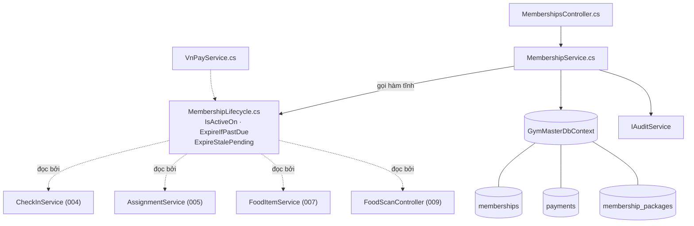
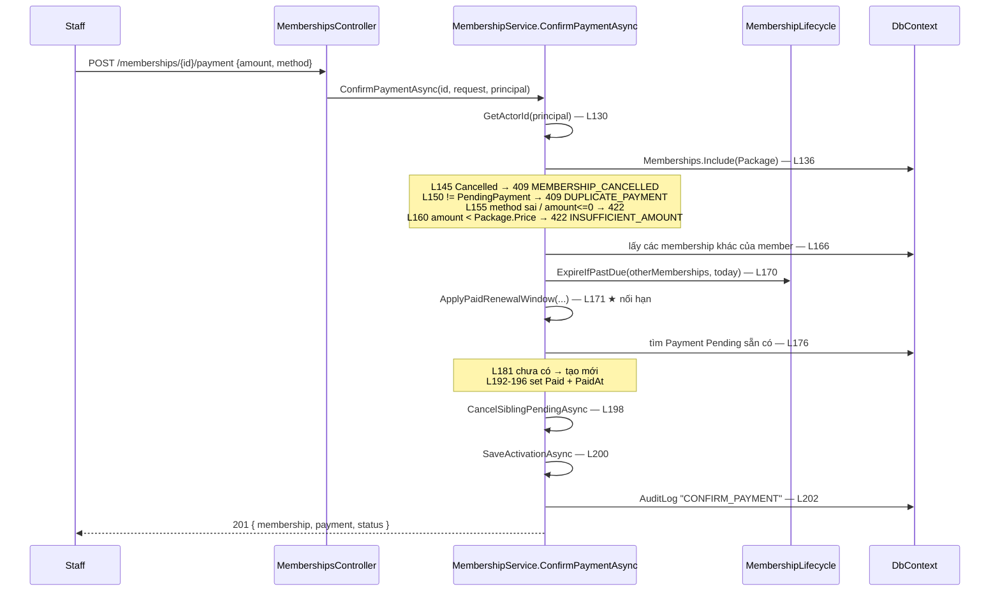

# Phân tích luồng: Membership & Billing (spec 003)

**Phiên bản:** 1.0 · **Phạm vi:** `backend/GymMaster.API/Features/Billing/`
**Spec:** [003-membership-billing](../../03-Interface-Specs/feature-specs/003-membership-billing/spec.md) · [plan](../../03-Interface-Specs/feature-specs/003-membership-billing/plan.md)

> Feature này được **7 feature khác phụ thuộc**. Số dòng trích dẫn theo bản code hiện hành.

---

## 1. Tóm tắt

Vòng đời một gói tập: **bán** (tạo đơn chờ) → **thu tiền** (kích hoạt) → **gia hạn / huỷ**. Điểm vào là `MembershipsController`, toàn bộ nghiệp vụ nằm ở `MembershipService.cs` (~680 dòng — file nghiệp vụ lớn nhất dự án), luật vòng đời tách riêng ở `MembershipLifecycle.cs`.

Chỉ có **tầng API + Service + DbContext** — không có Repository (ARCH-01).

## 2. Bản đồ cấu trúc

| File | Vai trò | Loại |
|---|---|---|
| [`MembershipsController.cs`](../../../backend/GymMaster.API/Features/Billing/MembershipsController.cs) | Nhận request `/memberships/*`; sell/payment/renew chỉ Staff, tra cứu Admin/Staff | Controller |
| [`MembershipService.cs`](../../../backend/GymMaster.API/Features/Billing/MembershipService.cs) | Toàn bộ nghiệp vụ bán/thu/gia hạn/huỷ | Service |
| [`MembershipLifecycle.cs`](../../../backend/GymMaster.API/Features/Billing/MembershipLifecycle.cs) | **Luật vòng đời dùng chung** — 3 hàm tĩnh, không I/O | Domain rule |
| [`PaymentService.cs`](../../../backend/GymMaster.API/Features/Billing/PaymentService.cs) | Tra cứu + tổng hợp doanh thu (không kích hoạt gói) | Service |
| [`VnPayService.cs`](../../../backend/GymMaster.API/Features/Billing/VnPayService.cs) | Đường kích hoạt thứ hai — xem [phân tích VNPay](vnpay_payment_feature_analysis.md) | Service |
| [`Membership.cs`](../../../backend/GymMaster.API/Entities/Membership.cs) · [`Payment.cs`](../../../backend/GymMaster.API/Entities/Payment.cs) | Entity | Entity |

### Các hàm public của `MembershipService`

| Dòng | Hàm | FR |
|---|---|---|
| 32 | `SellAsync` | FR-MS-01 |
| 124 | `ConfirmPaymentAsync` | FR-MS-02 / FR-PAY-01 |
| 218 | `RenewAsync` | FR-MS-03 |
| 310 | `CreateRenewalRequestAsync` | FR-MS-04 |
| 397 | `CancelAsync` | FR-MS-08 |
| 447 | `GetMembershipsForMemberAsync` | FR-MS-09 |
| 490 | `GetAllAsync` | roster Admin/Staff |

## 3. Bản đồ kết nối



| Từ | Đến | Cách | Dữ liệu |
|---|---|---|---|
| `MembershipsController` | `MembershipService` | gọi method, truyền `ClaimsPrincipal` | request DTO + identity |
| `MembershipService` | `MembershipLifecycle` | gọi hàm **static** | danh sách `Membership` + `today` (giờ VN) |
| `MembershipService` | `DbContext` | LINQ trực tiếp | entity |
| `MembershipService` | `IAuditService` | `LogAsync` | action + entityId + metadata |
| `VnPayService` | `MembershipLifecycle` | gọi hàm static | như trên |

## 4. Luồng xác nhận thanh toán (bước quan trọng nhất)

`POST /api/v1/memberships/{id}/payment` → `ConfirmPaymentAsync` ([dòng 124](../../../backend/GymMaster.API/Features/Billing/MembershipService.cs))



## 5. Vai trò từng đoạn code quyết định

### 5.1. Tái dùng `Payment` Pending — chống thu tiền hai lần

`MembershipService.cs` **L176–190**

```csharp
// Nguon su that DUY NHAT cho tien cua don = 1 Payment.
// Tai dung payment Pending neu da co (vd member da khoi tao VNPay) thay vi tao dong moi
// -> tranh 2 dong Payment / 1 don va chong thu tien 2 lan khi staff thu tay xen vao luong online.
var payment = await _dbContext.Payments
    .FirstOrDefaultAsync(
        item => item.MembershipId == membership.Id && item.Status == PaymentStatus.Pending,
        cancellationToken);

if (payment is null)          // chưa có → tạo dòng mới
{
    payment = new Payment { MembershipId = membership.Id, CreatedByUserId = actorId.Value, ... };
    _dbContext.Payments.Add(payment);
}
```

**Vì sao cần thiết:** kịch bản thật — member bấm "thanh toán VNPay" (sinh `Payment` Pending) rồi đổi ý ra quầy trả tiền mặt. Không tái dùng thì có **2 dòng `Payment` cho 1 đơn**, báo cáo doanh thu cộng đôi.

### 5.2. Nối hạn — `ApplyPaidRenewalWindow`

`MembershipService.cs` **L596–618**

```csharp
var activeMembership = otherMemberships.FirstOrDefault(item => MembershipLifecycle.IsActiveOn(item, today));

membership.EndDate = activeMembership is null
    ? today.AddDays(membership.Package.DurationDays)          // không còn gói → tính từ hôm nay
    : activeMembership.EndDate.AddDays(membership.Package.DurationDays);  // còn gói → NỐI TIẾP

membership.Status = MembershipStatus.Active;

if (activeMembership is not null)
{
    activeMembership.Status = MembershipStatus.Cancelled;     // giữ bất biến 1 Active/member
    activeMembership.UpdatedAt = now;
}
```

Đây là chỗ thi hành **BIZ-01** (tối đa 1 Membership Active). Khách mua trước khi hết hạn không mất số ngày còn lại; gói cũ chuyển `Cancelled` — dễ gây hiểu nhầm là "bị huỷ", nhưng cần thiết để giữ bất biến.

### 5.3. `SaveActivationAsync` — vòng lách unique index

`MembershipService.cs` **L573–594**

```csharp
if (replacedActive is null || !_dbContext.Database.IsRelational())
{
    await _dbContext.SaveChangesAsync(cancellationToken);   // đường nhanh (gồm cả test InMemory)
    return;
}

var finalStatus = membership.Status;
membership.Status = MembershipStatus.PendingPayment;        // ① tạm hạ trạng thái

await using var transaction = await _dbContext.Database.BeginTransactionAsync(cancellationToken);
await _dbContext.SaveChangesAsync(cancellationToken);       // ② ghi: gói cũ Cancelled trước

membership.Status = finalStatus;                            // ③ nâng lại thành Active
await _dbContext.SaveChangesAsync(cancellationToken);
await transaction.CommitAsync(cancellationToken);
```

**Vì sao phải làm 2 lượt ghi:** nếu ghi một lượt, sẽ có khoảnh khắc **hai** membership cùng `Active` cho một member → vi phạm ràng buộc ở DB. Cách xử lý: hạ đơn mới xuống `PendingPayment`, ghi cho gói cũ `Cancelled` xong, rồi mới nâng lên `Active` — tất cả trong một transaction.

Nhánh `!IsRelational()` là để test EF InMemory chạy được (InMemory không hỗ trợ transaction).

## 6. Dữ liệu di chuyển như thế nào

Theo dõi **số tiền** một gói 30 ngày giá 500.000đ:

| Bước | Ở đâu | Giá trị |
|---|---|---|
| Định nghĩa gói | `membership_packages.Price` | `DECIMAL(12,2)` = `500000.00` |
| Bán gói | chưa có `Payment` | — |
| Staff nhập tiền | `ConfirmPaymentRequest.Amount` | client gửi lên |
| Kiểm tra | L160 `request.Amount < membership.Package.Price` | **giá gốc lấy từ Package ở server**, không tin client |
| Ghi nhận | `payments.Amount` | `500000.00` |
| Báo cáo | `PaymentService` → `PaymentSummaryResponse` | gom `byMethod`/`byDay` theo **ngày VN** |
| Nếu qua VNPay | `vnp_Amount` | `Package.Price × 100` = `50000000` (số nguyên) |

Không có bước nào dùng `float` (BIZ-05).

## 7. Bảng tra cứu

| Bước | File | Hàm | Dòng | Kết nối tới | Ghi chú |
|---|---|---|---|---|---|
| Bán gói | `MembershipService.cs` | `SellAsync` | 32 | DbContext | tạo `PendingPayment` |
| Thu tiền | `MembershipService.cs` | `ConfirmPaymentAsync` | 124 | Lifecycle · Audit | → `Active` |
| Nối hạn | `MembershipService.cs` | `ApplyPaidRenewalWindow` | 596 | Lifecycle | BIZ-01 |
| Ghi an toàn | `MembershipService.cs` | `SaveActivationAsync` | 573 | transaction | tránh 2 Active |
| Huỷ đơn Pending anh em | `MembershipService.cs` | `CancelSiblingPendingAsync` | 558 | DbContext | |
| Gia hạn | `MembershipService.cs` | `RenewAsync` | 218 | | kéo dài tại chỗ |
| Member xin gia hạn | `MembershipService.cs` | `CreateRenewalRequestAsync` | 310 | | chỉ tạo Pending |
| Huỷ | `MembershipService.cs` | `CancelAsync` | 397 | | ownership check |
| Luật vòng đời | `MembershipLifecycle.cs` | `IsActiveOn` · `ExpireIfPastDue` · `ExpireStalePending` | 13 · 20 · 34 | **7 feature** | static, không I/O |

## 8. Phát hiện khi phân tích

> ⚠️ **Ba hàm private bị trùng lặp giữa `MembershipService.cs` và `VnPayService.cs`** — nội dung **giống hệt nhau từng dòng**:
>
> | Hàm | `MembershipService.cs` | `VnPayService.cs` |
> |---|---|---|
> | `CancelSiblingPendingAsync` | L558–571 | L244–257 |
> | `SaveActivationAsync` | L573–594 | L259–280 |
> | `ApplyPaidRenewalWindow` | L596–618 | L292–314 |
>
> Ba hàm này chứa **luật nối hạn (BIZ-01)** — đúng loại business rule mà [`GBL-02`](../../01-SRS-Requirements/constraints/global.md) yêu cầu chỉ tồn tại một nguồn. `MembershipLifecycle.cs` sinh ra chính vì vấn đề này (gom 3 bản sao lệch nhau), nhưng **đợt gom đó bỏ sót 3 hàm này**.
>
> **Rủi ro:** sửa luật nối hạn ở một file mà quên file kia → luồng thủ công và luồng VNPay kích hoạt gói khác nhau. Đây đúng là kiểu bug đã từng xảy ra.
>
> **Đề xuất:** chuyển 3 hàm vào `MembershipLifecycle` (phần thuần) + một helper dùng chung cho phần chạm DbContext. → việc **B-20** trong [BACKLOG](../../03-Interface-Specs/feature-specs/BACKLOG.md).

## 9. Mục cần bổ sung context

- `SellAsync` (L32–122) chưa phân tích chi tiết trong tài liệu này — luồng đơn giản hơn `ConfirmPaymentAsync` và đã mô tả đủ ở `plan.md` §6.
- `PaymentService.cs` (tổng hợp doanh thu `byMethod`/`byDay`) chưa có unit test nên **hành vi biên chưa được kiểm chứng** — việc B-05.
