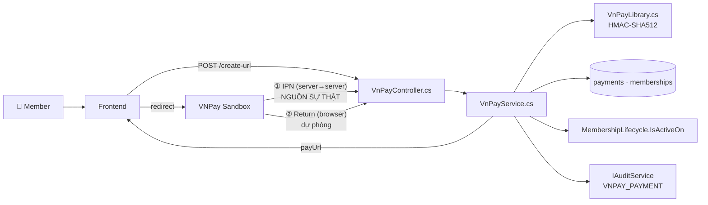
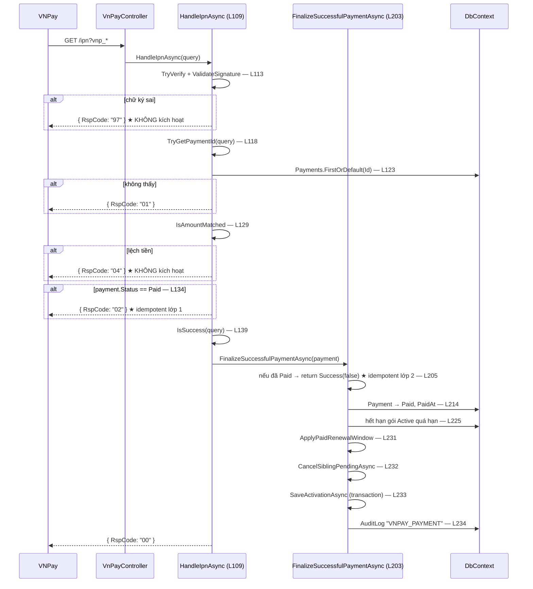

# Phân tích luồng: Thanh toán online VNPay (spec 010)

**Ngày phân tích:** 2026-07-23 · **Nguồn:** đọc trực tiếp `Features/Billing/VnPayService.cs` (~440 dòng) + `Infrastructure/VnPayLibrary.cs`
**Spec:** [010-online-payment-vnpay](../../03-Interface-Specs/feature-specs/010-online-payment-vnpay/spec.md) · [plan](../../03-Interface-Specs/feature-specs/010-online-payment-vnpay/plan.md)

> Feature nhạy cảm nhất về bảo mật: sai là sai doanh thu hoặc thủng lỗ hổng giả mạo callback. **Hai đường** cùng kích hoạt được gói → bắt buộc idempotent.

---

## 1. Tóm tắt

3 endpoint dưới `/api/v1/payments/vnpay`:

| Endpoint | Ai gọi | Vai trò |
|---|---|---|
| `POST /create-url` | Member (sở hữu) · Admin · Staff | Sinh URL thanh toán đã ký HMAC-SHA512 |
| `GET /ipn` | **VNPay** (server → server) | **Nguồn sự thật** — kích hoạt membership |
| `GET /return` | trình duyệt người dùng | Hiển thị kết quả + **finalize dự phòng** |

Không có bảng DB mới — tái dùng `payments` / `memberships` của spec 003.

## 2. Bản đồ cấu trúc

| File | Vai trò | Loại |
|---|---|---|
| [`VnPayController.cs`](../../../backend/GymMaster.API/Features/Billing/VnPayController.cs) | 3 action; `ipn`/`return` là `AllowAnonymous` | Controller |
| [`VnPayService.cs`](../../../backend/GymMaster.API/Features/Billing/VnPayService.cs) | Nghiệp vụ: ký, verify, đối chiếu tiền, kích hoạt | Service |
| [`VnPayLibrary.cs`](../../../backend/GymMaster.API/Infrastructure/VnPayLibrary.cs) | Dựng query string sắp xếp + HMAC-SHA512 | Infrastructure |
| [`VnPayOptions.cs`](../../../backend/GymMaster.API/Options/VnPayOptions.cs) | `TmnCode`, `HashSecret` (User Secrets), `BaseUrl`, `ReturnUrl` | Options |
| [`VnPayServiceTests.cs`](../../../tests/GymMaster.Api.Tests/VnPayServiceTests.cs) | 6 test — phủ đủ 6/6 AC | Test |

### Hàm chính

| Dòng | Hàm | Vai trò |
|---|---|---|
| 30 | `CreatePaymentUrlAsync` | tạo/tái dùng `Payment` Pending, sinh payUrl |
| 109 | `HandleIpnAsync` | xử lý IPN, trả `RspCode` |
| 152 | `HandleReturnAsync` | verify + finalize dự phòng |
| 203 | `FinalizeSuccessfulPaymentAsync` | **kích hoạt — idempotent** |
| 316 | `BuildPayUrl` | dựng URL + ký |
| 341 | `ValidateSignature` | verify chữ ký |
| 362 | `TryGetPaymentId` | parse `vnp_TxnRef` ngược ra `Payment.Id` |
| 390 | `CreateTxnRef` | sinh `GM{id}T{timestamp}` |
| 395 | `IsAmountMatched` | đối chiếu `vnp_Amount` |
| 406 | `IsSuccess` | `ResponseCode == "00" AND TransactionStatus == "00"` |

## 3. Bản đồ kết nối



## 4. Luồng IPN — đường kích hoạt chính

`GET /api/v1/payments/vnpay/ipn` → `HandleIpnAsync` (**L109**)



## 5. Vai trò từng đoạn code quyết định

### 5.1. Thứ tự gác cửa — verify chữ ký **trước tiên**

`VnPayService.cs` **L113–137**

```csharp
if (!TryVerify(query, out var inputHash) || !ValidateSignature(query, inputHash))
    return new VnPayIpnResponse("97", "Invalid signature");     // ① chữ ký

if (!TryGetPaymentId(query, out var paymentId))
    return new VnPayIpnResponse("01", "Order not found");        // ② parse TxnRef

var payment = await _dbContext.Payments.FirstOrDefaultAsync(item => item.Id == paymentId, ...);
if (payment is null)
    return new VnPayIpnResponse("01", "Order not found");        // ③ tồn tại

if (!IsAmountMatched(query, payment))
    return new VnPayIpnResponse("04", "Invalid amount");         // ④ đúng tiền

if (payment.Status == PaymentStatus.Paid)
    return new VnPayIpnResponse("02", "Order already confirmed"); // ⑤ idempotent
```

**Thứ tự này quan trọng.** Verify chữ ký đứng đầu nghĩa là request giả mạo **không chạm được vào DB** — không tra được id nào tồn tại, không dò được số tiền. Đảo thứ tự là mở kênh dò thông tin.

### 5.2. Idempotent **hai lớp**

Lớp 1 ở `HandleIpnAsync` L134; lớp 2 ở `FinalizeSuccessfulPaymentAsync` **L205–208**:

```csharp
if (payment.Status == PaymentStatus.Paid)
{
    return ServiceResult<bool>.Success(false);   // đã kích hoạt rồi — không làm gì thêm
}
```

Cần cả hai vì `FinalizeSuccessfulPaymentAsync` **có hai người gọi**: `HandleIpnAsync` (L141) và `HandleReturnAsync` (L181). Nếu chỉ chặn ở lớp 1, đường Return sẽ kích hoạt lần hai → cộng nhầm hạn gói (double-activation).

### 5.3. Luôn HTTP 200 — kể cả khi giao dịch thất bại

`VnPayService.cs` **L148–149**

```csharp
// Theo chuan VNPay: van ack "00" du giao dich that bai (chi khong kich hoat membership).
return new VnPayIpnResponse("00", "Confirm Success");
```

`RspCode "00"` ở đây nghĩa là *"tôi đã nhận và xử lý xong thông báo"*, **không** phải *"giao dịch thành công"*. Không ack thì VNPay retry vô ích. Giao dịch thất bại thì `IsSuccess(query)` ở L139 trả `false` → không gọi finalize → membership vẫn `PendingPayment`.

### 5.4. `vnp_TxnRef` — vì sao không dùng thẳng `Payment.Id`

`VnPayService.cs` **L390–392** và **L362–388**

```csharp
private static string CreateTxnRef(long paymentId, DateTime nowVn)
    => $"GM{paymentId}T{nowVn:yyyyMMddHHmmssfff}";
```

VNPay yêu cầu `TxnRef` **duy nhất mỗi lần tạo URL**. Dùng thẳng `Payment.Id` thì tạo lại link cho cùng đơn sẽ trùng → VNPay từ chối. Ghép timestamp giải quyết việc đó.

Hệ quả: khi verify phải **parse ngược** ra id, và chấp nhận **cả hai dạng** (L370 số thuần cho dữ liệu cũ, L375–387 dạng `GM…T…`):

```csharp
if (long.TryParse(raw, ..., out paymentId)) return true;        // dạng cũ: "42"
if (!raw.StartsWith("GM", StringComparison.OrdinalIgnoreCase)) return false;
var separatorIndex = raw.IndexOf('T', 2);
var idPart = raw[2..separatorIndex];                            // "GM42T2026..." → "42"
return long.TryParse(idPart, ..., out paymentId);
```

### 5.5. Đối chiếu tiền — chống sửa giá từ client

`VnPayService.cs` **L395–404**

```csharp
return amount == (long)(payment.Amount * 100);
```

`vnp_Amount` của VNPay tính bằng đơn vị nhỏ nhất (×100). Số so sánh là `payment.Amount` **đã lưu ở server** — mà giá trị đó lấy từ `Package.Price` lúc `CreatePaymentUrlAsync`, không bao giờ nhận từ client (SAFE-04). Không có đường nào để trả 1.000đ cho gói 1.000.000đ.

## 6. Dữ liệu di chuyển như thế nào

| Bước | Trường | Giá trị ví dụ |
|---|---|---|
| Gói tập | `membership_packages.Price` | `500000.00` (DECIMAL) |
| Tạo URL (L30) | `payments.Amount` | `500000.00` — **lấy từ Package ở server** |
| Gửi VNPay | `vnp_Amount` | `50000000` (số nguyên ×100) |
| | `vnp_TxnRef` | `GM42T20260723143052871` |
| | `vnp_SecureHash` | HMAC-SHA512 của query đã sắp xếp |
| Callback về | `vnp_ResponseCode` + `vnp_TransactionStatus` | `"00"` + `"00"` = thành công |
| Đối chiếu (L395) | so `vnp_Amount` với `Amount × 100` | lệch → `RspCode 04` |
| Kích hoạt (L214) | `payments.Status` · `PaidAt` | `Paid` · UTC now |
| | `memberships.Status` | `PendingPayment` → `Active` |
| Audit (L284) | `audit_logs` | `VNPAY_PAYMENT`, `UserId = null` (hệ thống) |

## 7. Bảng tra cứu

| Bước | Hàm | Dòng | Mã trả về khi lỗi |
|---|---|---|---|
| Tạo URL | `CreatePaymentUrlAsync` | 30 | 500 `VNPAY_NOT_CONFIGURED` · 403 · 404 · 409 `INVALID_MEMBERSHIP_STATE` |
| Ký | `BuildPayUrl` → `VnPayLibrary` | 316 | — |
| Verify chữ ký | `ValidateSignature` | 341 | IPN `97` · Return `400 INVALID_SIGNATURE` |
| Parse TxnRef | `TryGetPaymentId` | 362 | IPN `01` · Return `404` |
| Đối chiếu tiền | `IsAmountMatched` | 395 | IPN `04` · Return `400 INVALID_AMOUNT` |
| Idempotent lớp 1 | `HandleIpnAsync` | 134 | IPN `02` |
| Idempotent lớp 2 | `FinalizeSuccessfulPaymentAsync` | 205 | trả `Success(false)` |
| Kích hoạt | `FinalizeSuccessfulPaymentAsync` | 203 | IPN `99` nếu bị chặn |
| Audit | `LogVnPayPaymentAsync` | 282 | — |

## 8. Phát hiện khi phân tích

> ⚠️ **Trùng lặp với `MembershipService.cs`** — 3 hàm private giống hệt nhau từng dòng: `CancelSiblingPendingAsync` (L244), `SaveActivationAsync` (L259), `ApplyPaidRenewalWindow` (L292). Chi tiết và đề xuất ở [phân tích Membership & Billing §8](membership_billing_feature_analysis.md#8-phát-hiện-khi-phân-tích) → việc **B-20**.
>
> Đây chính là rủi ro lớn nhất của feature: luồng thủ công và luồng VNPay **phải kích hoạt gói giống hệt nhau**, mà hiện logic đó tồn tại hai bản.

## 9. Mục cần bổ sung context

- `VnPayLibrary.cs` (thuật toán dựng query string + HMAC) chưa phân tích từng dòng — hành vi đã được `VnPayServiceTests.cs` phủ bằng test *signature roundtrip*.
- Hành vi khi VNPay gửi IPN **trước** khi trình duyệt redirect về Return: theo code là an toàn (idempotent 2 lớp) nhưng **chưa có test đầu-cuối** mô phỏng thứ tự này.
