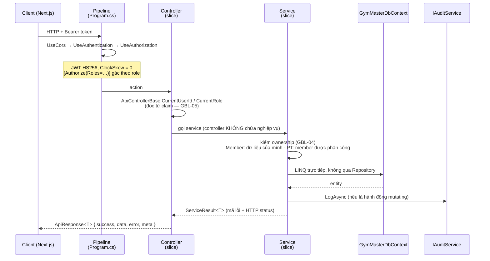
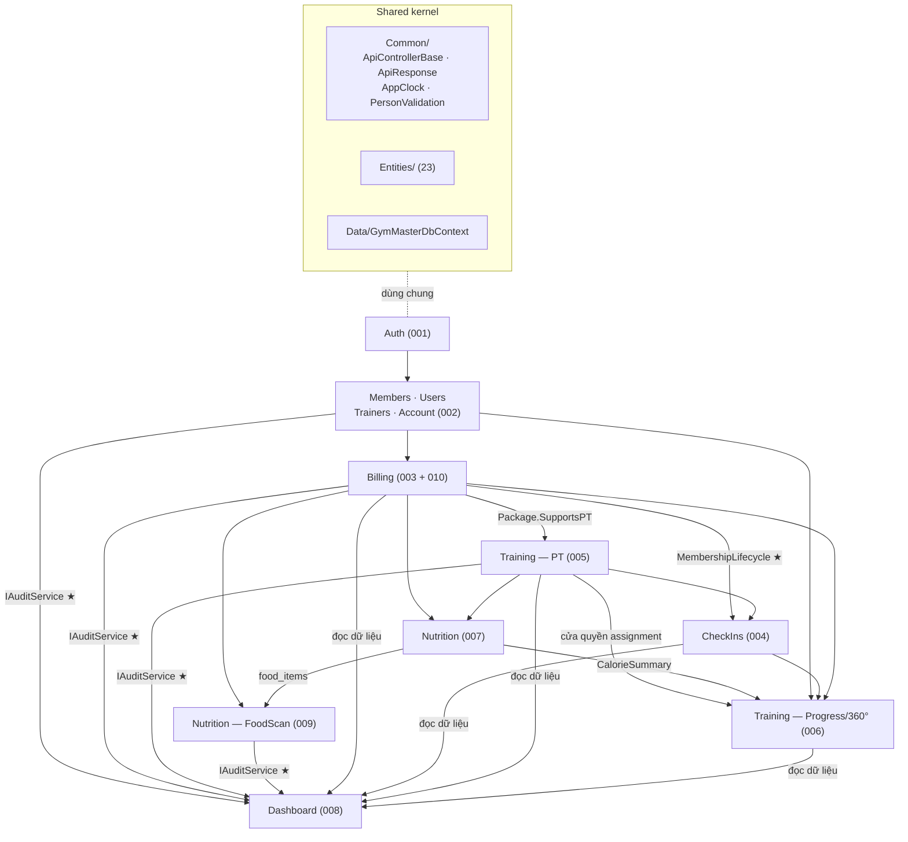

# Kiến trúc tổng thể — GymMaster Backend

**Cập nhật:** 2026-07-23 · **Nguồn:** rà từ code thật (`backend/GymMaster.API/`)
**Quy mô:** 10 slice · 24 controller · 19 service · 23 entity · ~85 endpoint

> Tài liệu này trả lời: *hệ thống gồm những mảnh nào, mảnh nào phụ thuộc mảnh nào, một request đi qua đâu.*
> Kiến trúc **cấp feature** (slice này quyết định gì, đánh đổi ra sao) nằm ở `plan.md` từng feature trong [`03-Interface-Specs/feature-specs/`](../../03-Interface-Specs/feature-specs/README.md).
> Kiến trúc **triển khai** (Cloud Run, Docker, CI/CD) nằm ở [`05-Deployment/deploy-diagram.md`](../../05-Deployment/deploy-diagram.md).

---

## 1. Nguyên tắc tổ chức: Vertical Slice

Code **không** chia theo tầng kỹ thuật (`Controllers/`, `Services/`, `Repositories/`) mà chia theo **feature**: mỗi `Features/<Tên>/` tự chứa controller + service + DTO của nó. Không có tầng Repository — service gọi thẳng `DbContext` (`CONSTITUTION.md` **ARCH-01**, v1.3.0).

```text
backend/GymMaster.API/
├── Features/            ← 10 slice, mỗi slice là một feature nghiệp vụ
│   ├── Auth/            1 controller · 1 service
│   ├── Account/         1 · 1
│   ├── Users/           1 · 1
│   ├── Members/         1 · 1
│   ├── Trainers/        1 · 1
│   ├── Billing/         6 · 4      ← lớn nhất (membership + payment + VNPay)
│   ├── CheckIns/        1 · 1
│   ├── Training/        6 · 4      ← PT + giáo án + ghi chú + tiến độ + 360°
│   ├── Nutrition/       4 · 3      ← nhật ký ăn + kho món + quét ảnh AI
│   └── Dashboard/       2 · 2      ← dashboard + AuditService (hạ tầng dùng chung)
│
├── Entities/            23 entity — dùng chung nhiều slice
├── Data/                GymMasterDbContext · DatabaseSeeder
├── Common/              ApiControllerBase · ApiResponse · ServiceResult · PagedResult
│                        AppClock · PersonValidation
├── Infrastructure/      cổng ra dịch vụ ngoài (đều sau interface)
│                        IAvatarStorage→Cloudinary · IEmailSender→MailKit
│                        IFoodImageAnalyzer→Gemini · VnPayLibrary
├── Options/             7 file cấu hình bind từ env/User-Secrets
└── Program.cs           DI · JWT · CORS · pipeline
```

**Vì sao slice, không phải layer:** 10 feature độc lập nhau về nghiệp vụ; sửa một feature chỉ đụng một thư mục. Tổ chức theo tầng thì sửa "check-in" phải mở 4 thư mục khác nhau. Đánh đổi: entity dùng chung phải đặt ngoài slice, và ranh giới slice cần kỷ luật (xem §4).

## 2. Một request đi qua đâu



Bốn điểm cố định của mọi luồng:

| Điểm | Ở đâu | Luật |
|---|---|---|
| Identity chỉ từ JWT claim | `Common/ApiControllerBase.cs` | GBL-05 |
| Kiểm quyền ở Service, không ở Controller | từng service | GBL-04 · ARCH-03 |
| Kết quả bọc `ApiResponse<T>` | `Common/ApiResponse.cs` | ARCH-02 |
| Hành động mutating ghi audit | `IAuditService` | AUDIT-01 |

## 3. Bản đồ phụ thuộc giữa các slice



### 3.1. Hai điểm chạm nguy hiểm nhất

Sửa hai chỗ này là đổi hành vi của nhiều feature cùng lúc:

| Thành phần | Ai phụ thuộc | Rủi ro |
|---|---|---|
| **`Features/Billing/MembershipLifecycle.cs`** | 003 · 004 · 005 · 006 · 007 · 009 · 010 — **7 feature** | Định nghĩa "gói còn hiệu lực". Từng có **3 bản sao lệch nhau** ở `MembershipService`/`ProgressService`/`VnPayService`, gây lỗi *gói hết hạn vẫn check-in được*. Đã gom về 1 nguồn (GBL-02) — **đừng copy lại**. |
| **`Features/Dashboard/IAuditService.cs`** | 002 · 003 · 005 · 006 · 007 · 009 · 010 | Ghi `audit_logs`. Đổi chữ ký hàm là đụng 13 service. Đăng ký DI **đầu tiên** trong `Program.cs` vì nhiều thứ phụ thuộc. |

> `IAuditService` nằm trong slice `Dashboard/` thay vì `Infrastructure/` — lựa chọn có tranh cãi, lý do và điều kiện nên chuyển ghi ở [`008-dashboard-audit/plan.md`](../../03-Interface-Specs/feature-specs/008-dashboard-audit/plan.md) §4.

### 3.2. Chiều phụ thuộc

- **Không có vòng lặp.** `Auth → Members → Billing → {CheckIns, Training, Nutrition} → Progress/360°`.
- **Dashboard là điểm cuối chiều đọc** — phụ thuộc nhiều nhất, không ai phụ thuộc ngược lại nó (trừ việc ghi audit).
- **Member 360° (006) là điểm tích hợp lớn nhất** — gom dữ liệu từ **5 spec khác**; sửa contract ở bất kỳ spec nào trong đó đều có thể làm hỏng nó.
- **009 (quét ảnh AI) và 010 (VNPay) là enhancement thuần** — gỡ ra hệ thống vẫn chạy đủ.

## 4. Kỷ luật ranh giới slice

Slice được phép phụ thuộc nhau, nhưng theo quy ước:

| Được | Không được |
|---|---|
| Gọi luật nghiệp vụ dùng chung (`MembershipLifecycle`) | **Copy** luật đó sang slice mình |
| Inject hạ tầng dùng chung (`IAuditService`, `IEmailSender`) | Tạo bản `DbContext` riêng cho slice |
| Đọc entity của slice khác qua `DbContext` | Gọi trực tiếp Service của slice khác (trừ hạ tầng) |
| Tái dùng DTO trong cùng slice | Chia sẻ DTO giữa hai slice — mỗi slice có contract riêng |

**Ví dụ đã áp dụng:** endpoint PT check-in hộ hội viên (`/pt/members/{id}/checkins`) nằm ở `Features/Training/PtController.cs` chứ không ở `CheckIns/` — vì điều kiện gác là "PT có assignment Active", dữ liệu thuộc slice Training. Đặt ở `CheckIns/` sẽ khiến `CheckInService` phụ thuộc ngược lên `AssignmentService`, tạo vòng.

## 5. Ràng buộc runtime định hình kiến trúc

| Ràng buộc | Hệ quả kiến trúc |
|---|---|
| **Cloud Run scale-to-zero** | Không có `BackgroundService`. Việc đến hạn xử lý **lazy** khi có truy vấn (`ExpireIfPastDue`, `ExpireStalePending`) — GBL-10 |
| **Schema do team DB sở hữu** | Không EF Migration; entity phải khớp schema có sẵn. Việc cần cột mới **bị chặn bởi team DB** — ARCH-04, GBL-08 |
| **Stateless** | Không session server-side; chỉ bảng `refresh_tokens` / `password_reset_tokens` |
| **Múi giờ container = UTC** | Mọi ngày nghiệp vụ qua `AppClock` (GMT+7) — GBL-01 |
| **Không cache** | Dashboard và 360° tính lại mỗi lần gọi để số liệu luôn khớp DB — GBL-09 |

## 6. Nhóm entity theo slice sở hữu

23 entity, `User` được **8/10 slice** dùng nên đặt ở `Entities/` chung.

| Slice sở hữu | Entity |
|---|---|
| Auth (001) | `User` · `Role` · `UserRole` · `RefreshToken` · `PasswordResetToken` |
| Members (002) | `MemberProfile` · `StaffProfile` · `TrainerProfile` |
| Billing (003/010) | `MembershipPackage` · `Membership` · `Payment` |
| CheckIns (004) | `CheckIn` |
| Training (005) | `TrainerAssignment` · `WorkoutPlan` · `WorkoutExercise` · `ExerciseCatalog` · `TrainerNote` |
| Progress (006) | `ProgressLog` |
| Nutrition (007/009) | `FoodItem` · `MealLog` · `MealLogItem` · `CalorieTarget` |
| Dashboard (008) | `AuditLog` |

Chi tiết cột, kiểu dữ liệu, index → [`database-design/database-schema.md`](../database-design/database-schema.md).

---

## Liên quan

- [`database-design/database-schema.md`](../database-design/database-schema.md) — schema chi tiết 24 bảng
- [`feat_flow/`](../feat_flow/) — phân tích luồng từng feature (khi cần đào sâu hơn `plan.md` §6)
- [`03-Interface-Specs/feature-specs/`](../../03-Interface-Specs/feature-specs/README.md) — spec · plan · tasks từng feature
- [`01-SRS-Requirements/constraints/global.md`](../../01-SRS-Requirements/constraints/global.md) — `GBL-*` các ràng buộc nhắc tới ở trên
- [`05-Deployment/deploy-diagram.md`](../../05-Deployment/deploy-diagram.md) — kiến trúc triển khai
