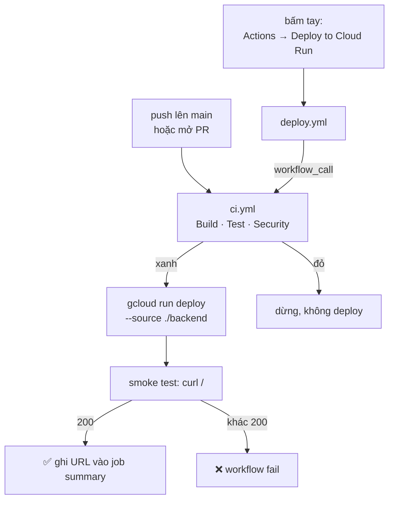

# CI/CD — GitHub Actions

**File thật:** [`.github/workflows/ci.yml`](../../.github/workflows/ci.yml) · [`.github/workflows/deploy.yml`](../../.github/workflows/deploy.yml)

Hai workflow, quan hệ **`deploy.yml` gọi lại `ci.yml`** — không chép bước build/test sang hai nơi nên hai file không bao giờ lệch nhau.



---

## 1. `ci.yml` — Build · Test · Security

**Kích hoạt:** push lên `main` · mọi pull request · bấm tay · **`workflow_call`** (để `deploy.yml` gọi lại).

| Bước | Làm gì | Ghi chú |
|---|---|---|
| Setup .NET 10 | `actions/setup-dotnet@v4`, `10.0.x` | |
| Restore | restore **từng project** | Repo **không có file `.sln`** nên không restore theo solution được |
| Build | build API + test project, `-c Release` | |
| Test | `dotnet test` | Test dùng **EF Core InMemory** → CI **không cần** SQL Server |
| Security | `dotnet list package --vulnerable --include-transitive` | ⚠️ xem bẫy bên dưới |

> **Bẫy đã được xử lý sẵn trong workflow:** `dotnet list --vulnerable` **luôn trả exit code 0**, kể cả khi tìm thấy lỗ hổng. Nếu chỉ dựa vào exit code thì CI sẽ **xanh giả**. Workflow phải `grep` chuỗi `"has the following vulnerable packages"` trong output rồi tự `exit 1`.
>
> Chính bước này từng bắt được **CVE-2026-49451** (`Microsoft.OpenApi` 2.0.0, High) — đó là lý do `.csproj` ghim thẳng `Microsoft.OpenApi` 2.7.5.

## 2. `deploy.yml` — Deploy to Cloud Run

**Kích hoạt:** **chỉ `workflow_dispatch`** (bấm tay). Cố ý **không** deploy tự động theo push.

> **Vì sao không auto-deploy?** Đang demo cho thầy mà ai đó push lên `main` là bản đang chạy bị thay bằng bản đang build → sập giữa chừng. Bấm tay = kiểm soát được thời điểm.

| Bước | Làm gì |
|---|---|
| `needs: ci` | **Bắt buộc CI xanh** mới deploy |
| Xác thực GCP | **Workload Identity Federation** — GitHub đổi OIDC token lấy quyền GCP |
| Deploy | `gcloud run deploy gymmaster-api --source ./backend --region asia-southeast1 --port 8080` |
| Smoke test | `curl` vào `/`, khác 200 là fail workflow |

### 2.1. Vì sao dùng Workload Identity Federation

Không có **file key JSON** nào tồn tại → không thể bị lộ, không phải xoay vòng key. GitHub tự đổi OIDC token lấy quyền tạm thời.

Cần `permissions: id-token: write` trong workflow, và 2 secret trong repo:

| Secret | Giá trị |
|---|---|
| `GCP_WIF_PROVIDER` | `projects/<PROJECT_NUM>/locations/global/workloadIdentityPools/github-pool/providers/github-provider` |
| `GCP_SERVICE_ACCOUNT` | `github-deployer@gymmaster-500004.iam.gserviceaccount.com` |

Cách tạo pool/provider: [deploy-gcp.md §6.1](deploy-gcp.md).

> ⚠️ Khi tạo provider **bắt buộc** có `--attribute-condition="assertion.repository_owner == '<ORG>'"`. Thiếu điều kiện này thì **bất kỳ repo GitHub nào trên đời** cũng mượn được service account của bạn.

### 2.2. Vì sao smoke test dùng `/` chứ không dùng `/openapi/v1.json`

`Program.cs` bọc `MapOpenApi()` trong `if (app.Environment.IsDevelopment())`, mà Cloud Run chạy Production → `/openapi/v1.json` **luôn 404 trên cloud**, chỉ sống ở local. Dùng nó để kiểm tra sẽ fail vĩnh viễn.

`/` trả `{"app":"GymMaster API","status":"running"}` và không cần auth.

### 2.3. Việc CD **không** làm — vẫn phải chạy tay

Workflow cố ý **không truyền `--env-vars-file`**, vì `env.yaml` chứa mật khẩu DB, `Jwt__SecretKey`, `VnPay__HashSecret` — không được commit. Bỏ flag đó thì Cloud Run **giữ nguyên env vars của revision cũ**, nên không phải nhét bí mật nào vào GitHub Secrets.

Đổi lại, ba việc này phải làm tay:

| Việc | Cách làm |
|---|---|
| **Thêm/đổi biến môi trường** | Chạy tay 1 lần với `--env-vars-file env.yaml` — nhớ giữ **đủ mọi key**, vì file thiếu key nào là **xoá** key đó khỏi service |
| **Đổi schema DB** | Chạy SQL lên Cloud SQL **TRƯỚC** khi bấm deploy, nếu không EF sẽ 500 |
| **Đổi `NEXT_PUBLIC_*` của frontend** | Sửa `ARG` trong Dockerfile của repo FE — giá trị được inline lúc build, không đọc từ env của Cloud Run |

## 3. Cách dùng hằng ngày

```text
Sửa code → push lên nhánh → mở PR → ci.yml tự chạy → review → merge vào main
                                                                    ↓
                          Actions → Deploy to Cloud Run → Run workflow → chọn main → Run
```

Deploy xong, URL hiện ở **job summary** của workflow.

## 4. Khi workflow fail — tra ở đâu

| Triệu chứng | Nguyên nhân thường gặp |
|---|---|
| Bước **Security** fail | Có package dính CVE. Xem `vuln.txt` trong log; ghim version đã vá vào `.csproj` như đã làm với `Microsoft.OpenApi` |
| Bước **Test** fail | Test thật sự hỏng — CI không cần DB nên không phải lỗi kết nối |
| **Xác thực GCP** fail | Secret sai/thiếu, hoặc thiếu `id-token: write`, hoặc `attribute-condition` không khớp owner repo |
| **Deploy** fail lúc build | Lỗi Dockerfile / restore — xem log Cloud Build; đối chiếu [docker.md](docker.md) |
| **Smoke test** trả khác 200 | Container không lên được: thường do thiếu env var (connection string, `Jwt__SecretKey`) ở revision mới, hoặc sai cổng. Xem log Cloud Run |

---

## Liên quan

- [deploy-gcp.md](deploy-gcp.md) — hạ tầng GCP, Cloud SQL, env vars, setup WIF
- [docker.md](docker.md) — Dockerfile và cách build/chạy container
- [deploy-diagram.md](deploy-diagram.md) — sơ đồ kiến trúc triển khai
