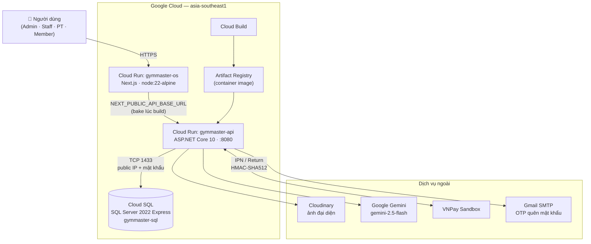
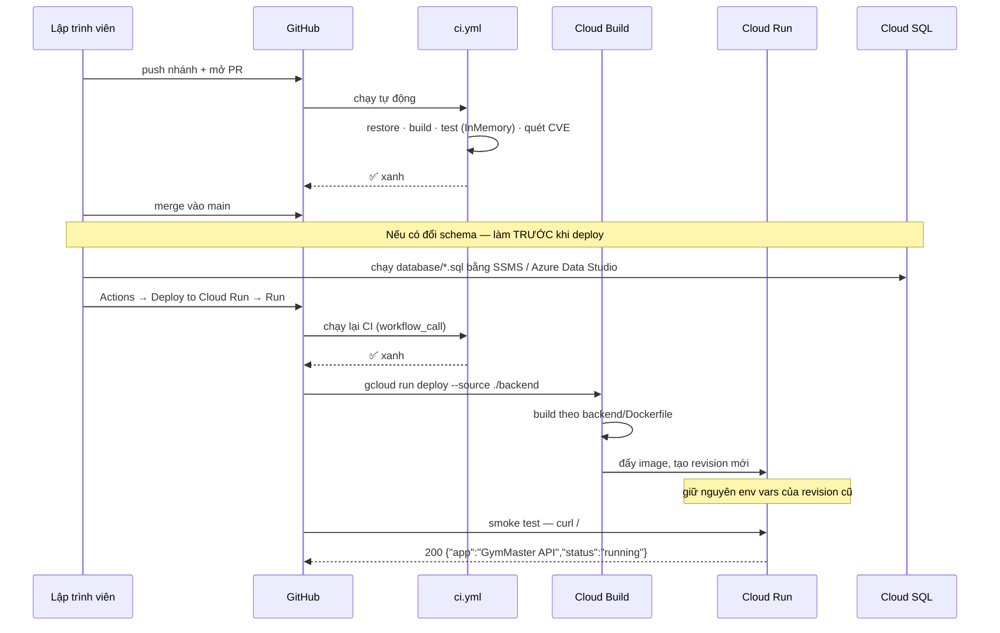

# Sơ đồ triển khai — GymMaster

**Môi trường:** Google Cloud, region `asia-southeast1` (Singapore), project `gymmaster-500004`

---

## 1. Kiến trúc triển khai

**Điểm cần biết:**

- **TLS terminate ở tầng Cloud Run**, không ở app. Vì vậy `Program.cs` chỉ gọi `UseHttpsRedirection()` khi `IsDevelopment()` — bật ở Production sẽ gây redirect loop.
- **Cloud Run scale-to-zero**: không có request thì không có container nào chạy. Đây là lý do hệ thống **không dùng background job**, mọi việc đến hạn xử lý kiểu *lazy* khi có truy vấn (xem [`constraints/global.md`](../01-SRS-Requirements/constraints/global.md) GBL-10).
- **Backend nối Cloud SQL qua public IP + mật khẩu** (không phải Private IP / VPC connector). Cloud Run không có IP tĩnh nên `authorized-networks` phải mở rộng — mức chấp nhận được cho demo, ghi rõ trong [deploy-gcp.md §3](deploy-gcp.md).
- **`NEXT_PUBLIC_API_BASE_URL` bake lúc build** ở phía FE, không đọc từ env runtime → đổi URL backend phải **rebuild FE**, không chỉ đổi env.

## 2. Luồng từ code tới production

## 3. Cấu hình theo môi trường

| | Local (Development) | Cloud Run (Production) |
|---|---|---|
| Database | SQL Server ở máy / LocalDB | Cloud SQL `gymmaster-sql` |
| Secret | **User Secrets** (`UserSecretsId` trong `.csproj`) | **env vars** của Cloud Run |
| HTTPS redirect | bật | **tắt** — TLS đã terminate ở Cloud Run |
| `/openapi/v1.json` | ✅ có | ❌ **404** — `MapOpenApi()` bọc trong `IsDevelopment()` |
| Email OTP | thiếu cấu hình → API vẫn 200 nhưng **không gửi mail** | cần đủ `Email__SenderEmail` + `Email__AppPassword` |
| VNPay | sandbox, IPN cần **tunnel** (ngrok / Cloudflare Tunnel) | sandbox, IPN gọi thẳng URL Cloud Run |
| Cổng | 5000/5001 | **8080** (`ASPNETCORE_URLS`) |

## 4. Biến môi trường bắt buộc trên Cloud Run

Thiếu nhóm **bắt buộc** thì container không lên được → smoke test fail.

| Biến | Bắt buộc | Ghi chú |
|---|:---:|---|
| `ASPNETCORE_ENVIRONMENT=Production` | ✅ | |
| `ConnectionStrings__DefaultConnection` | ✅ | `Server=<IP>,1433;Database=GymMasterDb;...;Encrypt=True;TrustServerCertificate=True;` |
| `Jwt__SecretKey` | ✅ | ≥ 32 ký tự |
| `Google__ClientId` | — | thiếu → `/auth/google` trả 500 `GOOGLE_NOT_CONFIGURED` |
| `VnPay__TmnCode` · `VnPay__HashSecret` · `VnPay__ReturnUrl` | — | thiếu → `create-url` trả 500 `VNPAY_NOT_CONFIGURED` |
| `Email__SenderEmail` · `Email__AppPassword` · `Email__FrontendBaseUrl` | — | thiếu → OTP **im lặng không gửi**, API vẫn trả 200 |
| `Cloudinary__*` | — | thiếu → upload avatar 500 `CLOUDINARY_NOT_CONFIGURED` |

> Dấu `__` (hai gạch dưới) là quy ước .NET cho cấu hình lồng nhau: `Jwt__SecretKey` ↔ `Jwt:SecretKey`. Một gạch dưới là sai và bị **bỏ qua im lặng**.
>
> ⚠️ CD **không** truyền `--env-vars-file`, nên revision mới **kế thừa** env của revision cũ. Thêm biến mới phải chạy tay một lần — xem [ci-cd.md §2.3](ci-cd.md).

## 5. Bảo mật hiện tại và giới hạn đã biết

| Hạng mục | Hiện tại | Ghi chú |
|---|---|---|
| Xác thực CD | Workload Identity Federation, **không có key JSON** | tốt |
| Secret ứng dụng | env vars Cloud Run, không commit | tốt |
| Kết nối DB | public IP + mật khẩu, `authorized-networks` mở rộng | ⚠️ chấp nhận cho demo; production thật nên dùng Private IP + Serverless VPC connector |
| CORS | `AllowAnyOrigin` | ⚠️ siết bằng `.WithOrigins("https://<app>.run.app")` trong `Program.cs` khi cần |
| Endpoint public | VNPay `ipn`/`return` là `AllowAnonymous` | bảo vệ bằng chữ ký HMAC-SHA512 — xem [`constraints/safety.md`](../01-SRS-Requirements/constraints/safety.md) SAFE-05 |

---

## Liên quan

- [deploy-gcp.md](deploy-gcp.md) — hướng dẫn thao tác từng bước
- [docker.md](docker.md) — Dockerfile và container
- [ci-cd.md](ci-cd.md) — hai workflow GitHub Actions
