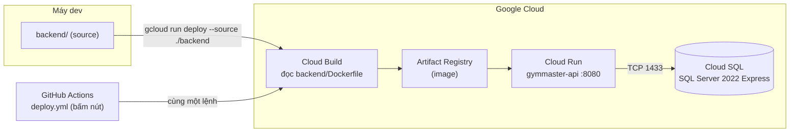

# Docker — GymMaster Backend

**File thật:** [`backend/Dockerfile`](../../backend/Dockerfile) · [`backend/.dockerignore`](../../backend/.dockerignore)

> **Docker được dùng ở đâu trong dự án này?** Chỉ một chỗ: **đóng gói backend để chạy trên Cloud Run**. Bình thường bạn **không cần cài Docker ở máy** — lệnh `gcloud run deploy --source ./backend` gửi source lên **Cloud Build**, Google build image hộ rồi đẩy vào Artifact Registry.
>
> Dự án **không dùng `docker-compose`**: chỉ có 1 container (backend), còn SQL Server chạy trên Cloud SQL, frontend là repo riêng. Không có gì để "compose".

---

## 1. Dockerfile — multi-stage, 2 tầng

```dockerfile
# ---- Build stage ----
FROM mcr.microsoft.com/dotnet/sdk:10.0 AS build      # ~800MB, có compiler
WORKDIR /src
COPY GymMaster.API/GymMaster.API.csproj GymMaster.API/
RUN dotnet restore GymMaster.API/GymMaster.API.csproj    # ← restore RIÊNG
COPY GymMaster.API/ GymMaster.API/
RUN dotnet publish ... -c Release -o /app/publish /p:UseAppHost=false

# ---- Runtime stage ----
FROM mcr.microsoft.com/dotnet/aspnet:10.0 AS final   # ~220MB, chỉ có runtime
WORKDIR /app
COPY --from=build /app/publish .
ENV ASPNETCORE_URLS=http://+:8080
EXPOSE 8080
ENTRYPOINT ["dotnet", "GymMaster.API.dll"]
```

Ba chi tiết đáng chú ý, đừng sửa nếu chưa hiểu:

| Chi tiết | Vì sao |
|---|---|
| **Copy `.csproj` rồi `restore` trước, copy source sau** | Docker cache theo layer. Sửa code mà không đổi dependency → layer restore được dùng lại, build nhanh hơn nhiều. Copy hết source lên trước là mất sạch cache mỗi lần sửa 1 dòng. |
| **`/p:UseAppHost=false`** | Không sinh file thực thi native (`GymMaster.API.exe`) — không cần, vì `ENTRYPOINT` gọi thẳng `dotnet GymMaster.API.dll`. Giảm kích thước image. |
| **`ASPNETCORE_URLS=http://+:8080`** | Cloud Run gửi request vào cổng `$PORT`, mặc định **8080**. Không set biến này thì Kestrel nghe cổng 5000/5001 → Cloud Run báo container không sẵn sàng và deploy fail. |

**Build context là `backend/`**, không phải thư mục gốc repo — nên đường dẫn trong Dockerfile là `GymMaster.API/...` chứ không phải `backend/GymMaster.API/...`. Đây là lý do lệnh deploy dùng `--source ./backend`.

## 2. `.dockerignore` — vì sao mỗi dòng có mặt ở đó

```
**/bin/                             ← artifact build ở máy, làm image phình + có thể lệch platform
**/obj/                             ← nt; còn chứa cache NuGet trỏ đường dẫn Windows
**/.vs/  **/.vscode/  **/*.user     ← file của IDE
**/appsettings.Development.json     ← ⚠️ CÓ THỂ CHỨA SECRET — tuyệt đối không vào image
**/.git/  **/.gitignore             ← lịch sử git nặng và không cần khi chạy
Dockerfile  .dockerignore           ← không cần chính nó bên trong image
```

Dòng quan trọng nhất là **`appsettings.Development.json`**. Docker build đọc từ **đĩa**, không đọc từ Git — nên dù file có bị `.gitignore` chặn hay không, thiếu dòng này là cấu hình máy dev đi thẳng vào image.

> ⚠️ **Lưu ý về file này trong repo GymMaster:** `.gitignore` hiện chỉ chặn `appsettings.*.local.json`, **không chặn** `appsettings.Development.json` — file này **đang được Git theo dõi**. Nội dung chỉ có cấu hình `Logging`, **không có secret**, nên an toàn. Nhưng đây là chỗ dễ vô tình thêm connection string vào rồi commit — nếu bắt đầu để secret ở đó thì phải `git rm --cached` và bổ sung vào `.gitignore` **trước**. Secret hiện nằm ở **User Secrets** (local) và **env vars Cloud Run** (production).

## 3. Chạy Docker ở máy (khi cần debug đúng môi trường production)

Không bắt buộc cho luồng deploy thường ngày. Dùng khi nghi image chạy khác local.

```bash
# Build (chú ý: context là ./backend)
docker build -t gymmaster-api ./backend

# Chạy, trỏ vào SQL Server bạn có sẵn
docker run --rm -p 8080:8080 \
  -e ASPNETCORE_ENVIRONMENT=Production \
  -e ConnectionStrings__DefaultConnection="Server=host.docker.internal,1433;Database=GymMasterDb;User Id=sa;Password=YOUR_PASS;Encrypt=True;TrustServerCertificate=True;" \
  -e Jwt__SecretKey="chuoi-bi-mat-dai-it-nhat-32-ky-tu-........" \
  gymmaster-api

# Kiểm tra sống
curl http://localhost:8080/
# {"app":"GymMaster API","status":"running"}
```

**Ba cái bẫy khi chạy local:**

- **`host.docker.internal`** là cách container gọi ra SQL Server chạy trên máy host. Dùng `localhost` sẽ trỏ vào chính container → connection refused.
- **Dấu `__` (hai gạch dưới)** là quy ước .NET để lồng cấu hình: `ConnectionStrings__DefaultConnection` ↔ `ConnectionStrings:DefaultConnection`. Một gạch dưới là sai, biến bị bỏ qua im lặng.
- **`ASPNETCORE_ENVIRONMENT=Production`** làm `/openapi/v1.json` **404** — đúng như trên Cloud Run, vì `Program.cs` bọc `MapOpenApi()` trong `if (app.Environment.IsDevelopment())`. Đừng tưởng deploy hỏng. Muốn xem Swagger thì đổi sang `Development`.

Vài lệnh hay cần:

```bash
docker logs -f <container>            # xem log runtime
docker exec -it <container> sh        # vào trong container
docker build --no-cache -t gymmaster-api ./backend   # build lại sạch khi nghi cache bẩn
docker image prune -f                 # dọn image rác cho nhẹ máy
```

## 4. Docker chạy ở đâu trong luồng deploy



**Không có bước `docker build` nào chạy ở máy bạn** trong luồng chuẩn — Cloud Build làm hết. Đó là lý do máy không cài Docker vẫn deploy được.

## 5. Khi nào phải sửa Dockerfile

| Tình huống | Sửa gì |
|---|---|
| Nâng .NET (vd 10 → 11) | Đổi tag **cả hai** `FROM` (`sdk:` và `aspnet:`) + `TargetFramework` trong `.csproj` |
| Thêm project mới vào solution | Thêm dòng `COPY` cho `.csproj` đó **trước** bước `restore` |
| Cần file tĩnh lúc chạy (cert, template) | `COPY` ở **runtime stage**, không phải build stage |
| Cần công cụ chỉ dùng lúc build | Cài ở **build stage** — runtime stage không nên phình |
| Đổi cổng | Sửa `ASPNETCORE_URLS` **và** `EXPOSE` **và** `--port` trong lệnh deploy — lệch một chỗ là Cloud Run fail |

---

## Liên quan

- [deploy-gcp.md](deploy-gcp.md) — quy trình deploy đầy đủ (Cloud SQL, env vars, Workload Identity Federation, CD)
- [ci-cd.md](ci-cd.md) — hai workflow GitHub Actions
- [deploy-diagram.md](deploy-diagram.md) — sơ đồ kiến trúc triển khai
