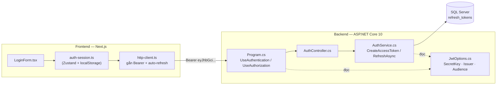
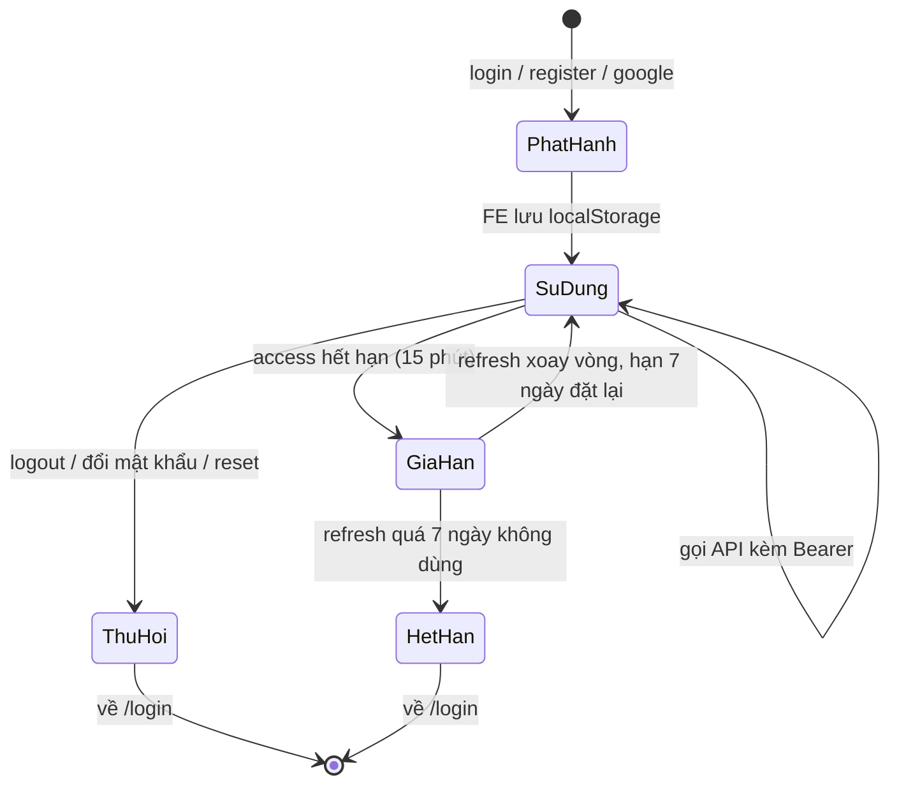
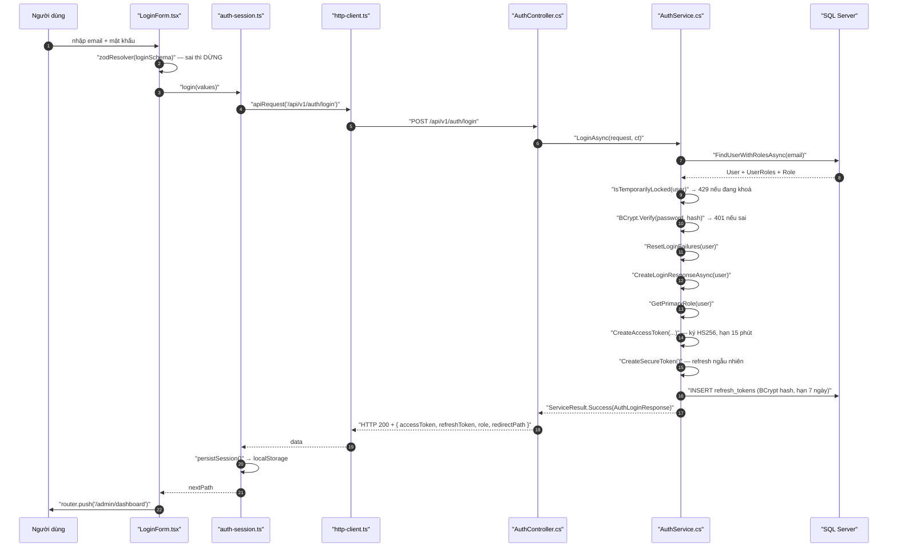
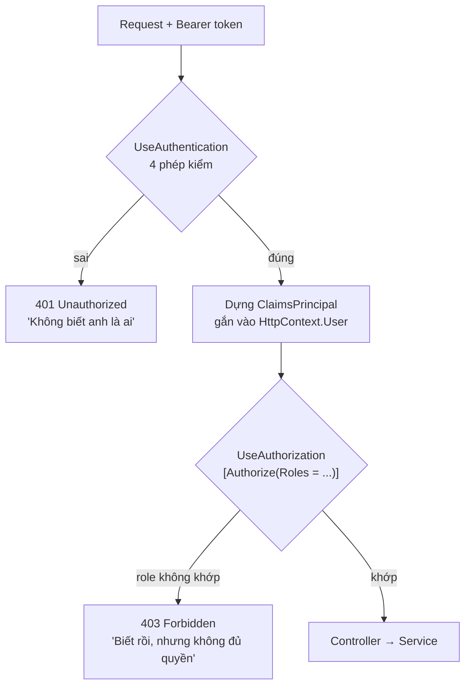
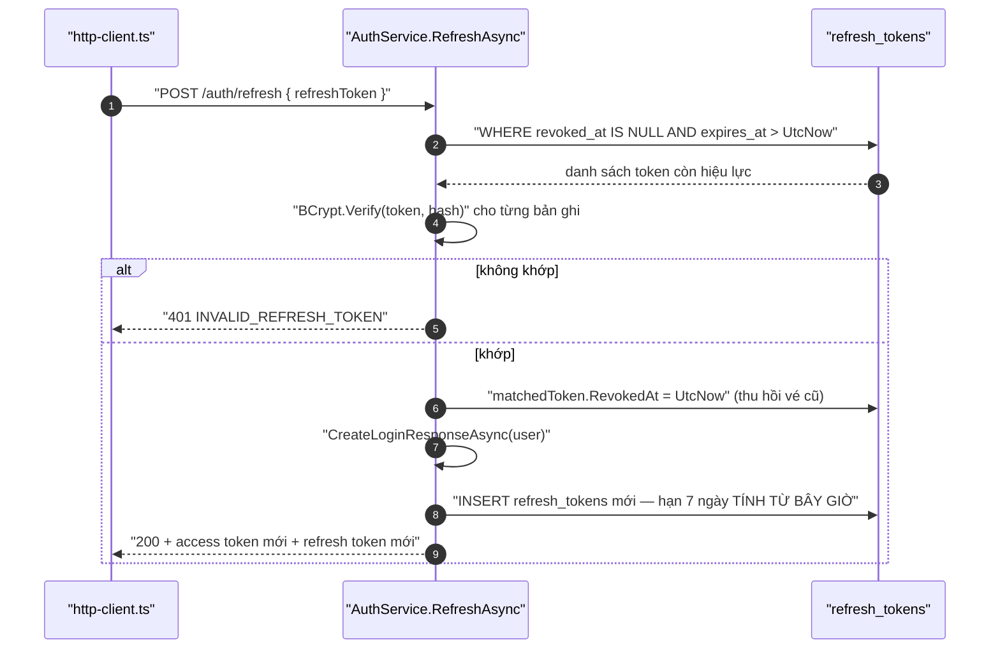

# 08 — Luồng JWT đầy đủ (Auth Token Lifecycle)

**Phiên bản:** 1.0 · **Ngày:** 2026-07-24 · **Phụ trách:** N1 — Như (`BanhMiChao`)
**Phạm vi:** vòng đời access token & refresh token, từ lúc phát hành tới lúc thu hồi — **cả frontend lẫn backend**.
**Spec liên quan:** [001-auth-rbac](../03-Interface-Specs/feature-specs/001-auth-rbac/spec.md)
**Tài liệu liên quan:** [auth_feature_analysis.md](../02-SDD-Architecture/feat_flow/auth_feature_analysis.md) (giải phẫu cả 9 endpoint) · [system-overview.md](../02-SDD-Architecture/system-design/system-overview.md)

> **Khác gì `auth_feature_analysis.md`:** file kia mô tả **toàn bộ feature Auth** (9 endpoint: đăng ký, OTP, Google…).
> File này chỉ theo **một sợi duy nhất — cái token** — nhưng đi hết cả hai đầu FE↔BE và đủ 5 chặng vòng đời.
> Dùng khi cần trả lời *"cái vé đó sinh ra ở đâu, đi qua đâu, chết như thế nào"*.

**Nguyên tắc biên soạn:** mọi khẳng định đều trích từ source code thật kèm số dòng. Không suy đoán.

---

## 1. Tóm tắt một phút

GymMaster xác thực theo mô hình **stateless JWT + refresh token xoay vòng**.

| | Access token | Refresh token |
|---|---|---|
| Bản chất | JWT ký **HS256** | Chuỗi ngẫu nhiên (không phải JWT) |
| Hạn | **15 phút** | **7 ngày** |
| Server lưu? | **Không** | **Có** — bảng `refresh_tokens`, dạng **băm BCrypt cost 12** |
| Thu hồi được? | Không | **Có** — cột `revoked_at` |
| Nằm ở đâu | `localStorage` của trình duyệt | `localStorage` của trình duyệt |

Server **không giữ phiên đăng nhập nào**. Mỗi request tự chứng minh danh tính bằng chữ ký trên token.

---

## 2. Bản đồ thành phần



**Điểm ra của feature không phải response, mà là JWT claim** — 9 feature còn lại đọc identity từ claim chứ không gọi lại `AuthService`.

---

## 3. Cấu tạo token trong hệ thống này

### 3.1 Ba phần

```
eyJhbGciOiJIUzI1NiJ9  .  eyJzdWIiOiIxIiwicm9sZSI6ImFkbWluIn0  .  4f2c9a...
└──── header ────┘       └──────────── payload ────────────┘     └ chữ ký ┘
   {"alg":"HS256"}         5 claim + iss/aud/exp                  HMAC-SHA256
```

⚠️ **Payload chỉ mã hoá Base64, KHÔNG bí mật** — dán vào jwt.io là đọc được hết.
JWT bảo vệ **tính toàn vẹn** (chống sửa), **không** bảo vệ **tính bí mật**.
→ Vì vậy không claim nào chứa dữ liệu nhạy cảm.

### 3.2 Năm claim — [`AuthService.cs:598-605`](../../backend/GymMaster.API/Features/Auth/AuthService.cs#L598-L605)

```csharp
var claims = new List<Claim>
{
    new(JwtRegisteredClaimNames.Sub, user.Id.ToString()),
    new(JwtRegisteredClaimNames.Email, user.Email),
    new(ClaimTypes.NameIdentifier, user.Id.ToString()),
    new(ClaimTypes.Name, user.FullName),
    new(ClaimTypes.Role, role)
};
```

| Claim | Giá trị | Dùng để làm gì |
|---|---|---|
| `sub` | `user.Id` | Định danh — chuẩn quốc tế của JWT |
| `email` | `user.Email` | Hiển thị |
| `nameidentifier` | `user.Id` | Định danh — quy ước .NET |
| `name` | `user.FullName` | Hiển thị |
| **`role`** | `admin`/`staff`/`pt`/`member` | ⭐ **Quyết định toàn bộ phân quyền** |

> `sub` và `nameidentifier` **cùng chứa user ID** — không thừa. Code đọc theo cả hai đường, có fallback:
> ```csharp
> var value = principal.FindFirstValue(ClaimTypes.NameIdentifier)
>          ?? principal.FindFirstValue(JwtRegisteredClaimNames.Sub);
> ```
> ([`AuthService.cs:734-735`](../../backend/GymMaster.API/Features/Auth/AuthService.cs#L734-L735), lặp lại ở `AccountService.cs:414` và `MembershipService.cs:599`)

### 3.3 Cấu hình — [`JwtOptions.cs`](../../backend/GymMaster.API/Options/JwtOptions.cs)

| Thuộc tính | Giá trị mặc định | Ý nghĩa |
|---|---|---|
| `Issuer` | `GymMaster` | Ai phát token |
| `Audience` | `GymMaster.Client` | Token dùng cho client nào |
| `SecretKey` | *(rỗng — nạp từ User Secrets / env var)* | Khoá ký. **Không commit** |
| `AccessTokenMinutes` | `15` | Hạn access token |
| `RefreshTokenDays` | `7` | Hạn refresh token |

Nguồn secret theo môi trường:

| Môi trường | Cách nạp |
|---|---|
| Máy cá nhân | `dotnet user-secrets set "Jwt:SecretKey" "..."` |
| Cloud Run | env var `Jwt__SecretKey` (2 gạch dưới = dấu `:`) |

---

## 4. HS256 — ký và kiểm

**HS256 = HMAC + SHA-256** — băm *có khoá*. Không có `SecretKey` thì không băm ra đúng kết quả.

```
chữ ký = HMAC-SHA256( Base64(header) + "." + Base64(payload) , SecretKey )
```

Code — [`AuthService.cs:607-616`](../../backend/GymMaster.API/Features/Auth/AuthService.cs#L607-L616):

```csharp
var key = new SymmetricSecurityKey(Encoding.UTF8.GetBytes(_jwtOptions.SecretKey));
var credentials = new SigningCredentials(key, SecurityAlgorithms.HmacSha256);
var token = new JwtSecurityToken(
    _jwtOptions.Issuer, _jwtOptions.Audience, claims,
    expires: expiresAt, signingCredentials: credentials);
return new JwtSecurityTokenHandler().WriteToken(token);
```

**Vì sao sửa payload là lộ:** đổi `"role":"member"` → `"role":"admin"` thì server tính lại HMAC ra chữ ký khác → `ValidateIssuerSigningKey` thất bại → **401**. Ký lại cho khớp thì phải có `SecretKey`, mà nó không nằm trong token.

### HS256 vs RS256 — vì sao chọn HS256

| | HS256 (đang dùng) | RS256 |
|---|---|---|
| Khoá | 1 khoá, ký và kiểm chung | 2 khoá: private ký, public kiểm |
| Hợp với | **1 server tự ký tự kiểm** | Nhiều dịch vụ độc lập |

GymMaster chỉ có **một backend** vừa phát vừa kiểm → HS256 là đủ và đúng. RS256 giải bài toán *"bên thứ ba xác minh được mà không phát hành được"* — hệ thống này không có bài toán đó.
Điều kiện an toàn của HS256 là **giữ kín `SecretKey`** — đã xử lý bằng User Secrets + env var, không commit.

---

## 5. Năm chặng vòng đời



---

### Chặng A — PHÁT HÀNH

Xảy ra ở **4 điểm vào**, tất cả đều đổ về cùng một hàm:

| Điểm vào | Hàm | Dòng |
|---|---|---|
| `POST /auth/login` | `LoginAsync` | 107 |
| `POST /auth/register` | `RegisterAsync` | 48 |
| `POST /auth/google` | `GoogleLoginAsync` | 424 |
| `POST /auth/refresh` | `RefreshAsync` | 169 |

→ cả 4 gọi **`CreateLoginResponseAsync`** ([dòng 560](../../backend/GymMaster.API/Features/Auth/AuthService.cs#L560)) — điểm phát hành **duy nhất** của hệ thống.



**Sáu chốt kiểm tra trong `LoginAsync`, đúng thứ tự** ([dòng 107-167](../../backend/GymMaster.API/Features/Auth/AuthService.cs#L107-L167)):

| # | Chốt | Không đạt |
|---|---|---|
| 1 | Email/mật khẩu có trống? | `400 VALIDATION_ERROR` |
| 2 | User tồn tại? | `401 INVALID_CREDENTIALS` |
| 3 | Đang khoá tạm 15 phút? | `429 TOO_MANY_ATTEMPTS` |
| 4 | Bị Admin khoá hẳn? | `423 ACCOUNT_LOCKED` |
| 5 | `BCrypt.Verify` mật khẩu | `401` + tăng bộ đếm sai |
| 6 | Đạt hết → phát token | `200` |

> **BR — thứ tự không được đảo:** chốt 3 (khoá) đứng **trước** chốt 5 (verify mật khẩu). Nếu đảo, kẻ tấn công vẫn dò được mật khẩu đúng dù tài khoản đang bị khoá.

> **BR — chống user enumeration (OWASP):** chốt 2 và chốt 5 trả **cùng mã, cùng câu chữ** (hằng số `InvalidCredentialsMessage`). Báo rõ *"email không tồn tại"* sẽ cho phép bắn hàng loạt email để dò danh sách hội viên. **Không được "sửa" cho thân thiện hơn.**

---

### Chặng B — SỬ DỤNG

```
① persistSession(session)        → localStorage        (auth-session.ts:64)
② Mỗi request, http-client gắn:  Authorization: Bearer eyJhbGci...   (http-client.ts:186)
③ Trước khi gọi, ensureFreshSession() kiểm hạn        (auth-session.ts:127)
```

**Access token không được cấp lại theo đồng hồ.** Không có timer. Nó hết hạn sau 15 phút, và **lần gọi API kế tiếp** mới phát hiện rồi đi xin token mới. Xin **khi cần**, không phải **định kỳ**.

Cơ chế tự cứu ở [`http-client.ts:182-190`](../../../GymMaster-frontend/src/lib/api/http-client.ts#L182-L190): gặp 401 → tự refresh → **gọi lại request cũ** với cờ `{ retried: true }`. Người dùng không thấy gì.

> ⚠️ Endpoint auth bị **loại trừ** khỏi cơ chế này — comment ngay trong code ([`http-client.ts:70`](../../../GymMaster-frontend/src/lib/api/http-client.ts#L70)):
> ```ts
> // Endpoint auth (login/refresh) khong duoc retry-refresh de tranh vong lap.
> ```
> Không loại trừ thì `/auth/login` trả 401 (sai mật khẩu) → client tưởng hết hạn → gọi refresh → 401 → **lặp vô tận**.

---

### Chặng C — KIỂM TRA

Middleware, đúng thứ tự — [`Program.cs:116-119`](../../backend/GymMaster.API/Program.cs#L116-L119):

```csharp
app.UseCors("Frontend");
app.UseAuthentication();   // anh LÀ AI
app.UseAuthorization();    // anh ĐƯỢC LÀM GÌ
app.MapControllers();
```

**Authorization phải sau Authentication** — chưa biết là ai thì không xét được quyền.

Bốn phép kiểm, thiếu một là từ chối — [`Program.cs:52-62`](../../backend/GymMaster.API/Program.cs#L52-L62):

```csharp
ValidateIssuer = true,            // iss == "GymMaster"?
ValidateAudience = true,          // aud == "GymMaster.Client"?
ValidateLifetime = true,          // exp còn hạn?
ValidateIssuerSigningKey = true,  // chữ ký khớp SecretKey?
ClockSkew = TimeSpan.Zero
```

> **`ClockSkew = TimeSpan.Zero`** — mặc định .NET cho lệch **5 phút** (phòng đồng hồ máy chủ sai). Dự án đặt về 0: **hết hạn là hết hạn ngay**.



| Mã | Nghĩa | Chặn ở |
|---|---|---|
| **401** | Không có token / token hỏng / hết hạn | `UseAuthentication` |
| **403** | Token hợp lệ nhưng sai vai trò | `UseAuthorization` |

**Điểm phải nhớ:** bị chặn ở đây thì **service chưa từng được gọi** — không một dòng logic nghiệp vụ nào chạy. Ví dụ Staff gọi `GET /api/v1/users` (`[Authorize(Roles = Admin)]`): qua được 401 vì token hợp lệ, nhưng **403** và `UserService` không hề chạy.

> **BR — chống privilege escalation:** `userId`/`role` **luôn lấy từ claim**, không bao giờ nhận từ request body. Client sửa body thì vô hại; sửa token thì chữ ký sai → 401.

---

### Chặng D — GIA HẠN (refresh token rotation)

[`RefreshAsync` — dòng 169-201](../../backend/GymMaster.API/Features/Auth/AuthService.cs#L169-L201):



Hai dòng cốt lõi — [dòng 199-200](../../backend/GymMaster.API/Features/Auth/AuthService.cs#L199-L200):

```csharp
matchedToken.RevokedAt = DateTime.UtcNow;                    // thu hồi vé cũ
return await CreateLoginResponseAsync(matchedToken.User, ct); // phát vé mới hoàn toàn
```

#### Hệ quả: 7 ngày là hạn **không hoạt động**, không phải hạn tuyệt đối

| Kịch bản | Kết quả |
|---|---|
| Dùng app đều đặn | Mỗi lần refresh đặt lại đồng hồ 7 ngày → **không bao giờ bị đăng xuất** |
| Nghỉ > 7 ngày | `expires_at > UtcNow` sai → `401 INVALID_REFRESH_TOKEN` → về `/login` |

#### Vì sao phải thu hồi vé cũ

**Refresh token rotation** — mỗi refresh token **dùng đúng một lần rồi vứt**.

Không xoay vòng: kẻ trộm được token dùng song song với nạn nhân suốt 7 ngày, không ai biết.
Có xoay vòng: kẻ trộm dùng trước → vé của nạn nhân thành vô hiệu → nạn nhân bị đá ra → **dấu vết lộ ra ngay** thay vì âm thầm.

---

### Chặng E — THU HỒI

Ba đường, đều đặt `revoked_at`:

| Đường | Phạm vi | Hàm |
|---|---|---|
| `POST /auth/logout` | Mọi token còn hiệu lực của user | [`LogoutAsync` — 531](../../backend/GymMaster.API/Features/Auth/AuthService.cs#L531) |
| Đổi mật khẩu | **Toàn bộ** → mọi thiết bị khác văng ra | [`ChangePasswordAsync` — 418](../../backend/GymMaster.API/Features/Auth/AuthService.cs#L418) |
| Reset mật khẩu qua OTP | **Toàn bộ** | [`ResetPasswordAsync` — 370](../../backend/GymMaster.API/Features/Auth/AuthService.cs#L370) |

Hai đường sau dùng chung [`RevokeRefreshTokensAsync` — dòng 697](../../backend/GymMaster.API/Features/Auth/AuthService.cs#L697):

```csharp
var activeTokens = await _dbContext.RefreshTokens
    .Where(token => token.UserId == userId && token.RevokedAt == null && token.ExpiresAt > DateTime.UtcNow)
    .ToListAsync(cancellationToken);

foreach (var token in activeTokens) { token.RevokedAt = DateTime.UtcNow; }
```

> ⚠️ **Access token KHÔNG thu hồi được.** Nó stateless — server không giữ danh sách nào để đánh dấu.
> Sau khi logout, access token cũ **vẫn hợp lệ tối đa 15 phút nữa** nếu ai đó giữ được nó.
> Đây là **đánh đổi cố hữu của JWT**, và là lý do `AccessTokenMinutes` để ngắn (15 phút). Thầy hỏi *"logout xong token còn dùng được không?"* → trả lời đúng là **còn, tối đa 15 phút**.

---

## 6. Mã lỗi liên quan tới token

| Mã | HTTP | Sinh ở |
|---|---|---|
| `VALIDATION_ERROR` | 400 | Thiếu email/mật khẩu/refresh token |
| `INVALID_CREDENTIALS` | 401 | Sai email **hoặc** mật khẩu (cố ý mập mờ) |
| `INVALID_REFRESH_TOKEN` | 401 | Refresh token sai hoặc quá 7 ngày |
| `UNAUTHORIZED` | 401 | Token không đọc được claim `userId` (logout) |
| `TOO_MANY_ATTEMPTS` | **429** | Đăng nhập sai quá nhiều — dòng 136, 155 |
| `TOO_MANY_ATTEMPTS` | **401** | Sai OTP quá 3 lần — dòng 352 |
| `ACCOUNT_LOCKED` | 423 | Admin khoá tài khoản |
| `INVALID_GOOGLE_TOKEN` | 400 | ID token Google không hợp lệ |

> ⚠️ `TOO_MANY_ATTEMPTS` dùng **2 mã HTTP khác nhau** tuỳ luồng (429 khi login, 401 khi OTP). Khi viết RDS/SDS phải ghi đủ cả hai, đừng chép một dòng.

---

## 7. Quyết định thiết kế & đánh đổi

| Quyết định | Vì sao | Đánh đổi phải chấp nhận |
|---|---|---|
| **JWT stateless** thay vì session server | Cloud Run tự nhân bản container; container nào cũng tự kiểm được token, **không cần kho session dùng chung (Redis)** | Access token **không thu hồi được** trước khi hết hạn |
| **HS256** thay vì RS256 | Một server vừa ký vừa kiểm | Ai có `SecretKey` cũng ký được vé giả → phải giữ kín tuyệt đối |
| **Access 15 phút** | Lộ thì thiệt hại có hạn | Phải refresh thường xuyên |
| **Refresh 7 ngày + xoay vòng** | Không bắt đăng nhập lại liên tục; token dùng một lần | Thêm bảng DB, thêm truy vấn |
| **Băm BCrypt refresh token** | DB bị lộ cũng không dùng được | **Không tra được bằng `WHERE`** → phải duyệt (xem §8) |
| **`ClockSkew = 0`** | Hết hạn là hết hạn ngay | Đồng hồ server lệch là token hỏng sớm |
| **Lưu `localStorage`** | Đơn giản, sống qua tải lại trang | JavaScript đọc được → **dính XSS là mất token** (cookie `HttpOnly` an toàn hơn nhưng phức tạp hơn với CORS + Cloud Run 2 domain) |

### `localStorage` có quá tải khi đông người không? — **Không**

`localStorage` nằm **trên máy từng người dùng**, không phải trên server. 1000 hội viên = 1000 kho riêng trên 1000 máy riêng. Server giữ **0 byte** token. Mỗi origin còn được ~5–10 MB, mà một JWT chỉ ~500 byte.

Chỗ **thật sự** tăng theo số người là bảng `refresh_tokens` trong SQL Server — xem ngay dưới.

---

## 8. Điểm nghẽn đã biết

**`RefreshAsync` duyệt tuyến tính + BCrypt** — [dòng 181-189](../../backend/GymMaster.API/Features/Auth/AuthService.cs#L181-L189):

```csharp
var activeTokens = await _dbContext.RefreshTokens
    .Where(token => token.RevokedAt == null && token.ExpiresAt > DateTime.UtcNow)
    .ToListAsync(ct);                                   // tải TẤT CẢ token còn hiệu lực

var matchedToken = activeTokens.FirstOrDefault(token =>
    BCrypt.Net.BCrypt.Verify(request.RefreshToken, token.TokenHash));   // duyệt từng cái
```

**Vì sao buộc phải vậy:** BCrypt có salt ngẫu nhiên → cùng một token băm 2 lần ra 2 chuỗi khác nhau → **không thể `WHERE token_hash = @p0`**.

| Phiên đang hoạt động | Số phép BCrypt mỗi lần refresh (xấu nhất) |
|---|---|
| 100 | 100 |
| 1000 | 1000 (~vài giây) |

BCrypt cost 12 **cố ý chậm** — là tính năng khi băm mật khẩu, là gánh nặng khi chạy trong vòng lặp.

**Kết luận:** với quy mô MVP (~1000 hội viên, 1 chi nhánh, refresh 15 phút/lần) **chấp nhận được**. Nếu cần tối ưu: thêm cột định danh không băm (ví dụ `token_id` ngẫu nhiên) để `WHERE` trực tiếp, chỉ BCrypt.Verify **một** bản ghi.

---

## 9. Câu hỏi bảo vệ — trả lời sẵn

| Câu hỏi | Trả lời |
|---|---|
| Payload JWT có được mã hoá không? | Không, chỉ Base64 — ai cũng đọc được. An toàn nằm ở **chữ ký**, không ở việc giấu |
| Client sửa `role` trong body leo quyền được không? | Không. Server chỉ đọc role từ **claim** trong token đã ký |
| Sửa `role` trong token thì sao? | Chữ ký không khớp → `ValidateIssuerSigningKey` thất bại → 401 |
| Vì sao cần cả 2 loại token? | Đánh đổi bảo mật ↔ tiện dụng: access ngắn giới hạn thiệt hại, refresh dài đỡ phải đăng nhập lại |
| Vì sao JWT chứ không session? | Cloud Run scale ngang; container nào cũng tự kiểm được, không cần kho session dùng chung |
| Vì sao HS256 chứ không RS256? | Một server tự ký tự kiểm — RS256 giải bài toán mà hệ thống này không có |
| Logout xong access token cũ còn dùng được không? | **Còn, tối đa 15 phút.** Đánh đổi cố hữu của stateless |
| Sau 7 ngày thì sao? | Tuỳ hoạt động — refresh xoay vòng đặt lại đồng hồ. Chỉ **7 ngày không dùng** mới bị đăng xuất |
| Điểm nghẽn của hệ thống? | Vòng lặp BCrypt trong `RefreshAsync` (§8) |
| `ClockSkew = 0` để làm gì? | Bỏ dung sai 5 phút mặc định của .NET |

---

## 10. Bản đồ file:dòng

### Backend

| File | Dòng | Nội dung |
|---|---|---|
| [`AuthService.cs`](../../backend/GymMaster.API/Features/Auth/AuthService.cs) | 107 | `LoginAsync` — 6 chốt kiểm |
| | 169 | `RefreshAsync` — xoay vòng token |
| | 199-200 | Thu hồi vé cũ + phát vé mới |
| | 531 | `LogoutAsync` |
| | 560 | `CreateLoginResponseAsync` — **điểm phát hành duy nhất** |
| | 570-577 | Băm + lưu refresh token |
| | 591 | `CreateAccessToken` — ký HS256 |
| | 598-605 | 5 claim |
| | 669 | `FindUserWithRolesAsync` |
| | 697 | `RevokeRefreshTokensAsync` |
| | 734-735 | `GetUserId` — đọc claim có fallback |
| [`Program.cs`](../../backend/GymMaster.API/Program.cs) | 44-63 | Cấu hình `AddJwtBearer` |
| | 116-119 | Thứ tự middleware |
| [`JwtOptions.cs`](../../backend/GymMaster.API/Options/JwtOptions.cs) | toàn bộ | Issuer · Audience · SecretKey · hạn token |
| [`ApiControllerBase.cs`](../../backend/GymMaster.API/Common/ApiControllerBase.cs) | 7-20 | `ToActionResult` — `ServiceResult` → HTTP |

### Frontend

| File | Dòng | Nội dung |
|---|---|---|
| [`auth-session.ts`](../../../GymMaster-frontend/src/features/auth/session/auth-session.ts) | 64 | `persistSession` → localStorage |
| | 127 | `ensureFreshSession` — kiểm hạn, refresh khi cần |
| | 152 | `login` — hành động của store |
| [`http-client.ts`](../../../GymMaster-frontend/src/lib/api/http-client.ts) | 70 | Loại trừ endpoint auth khỏi retry-refresh |
| | 186 | Gắn header `Authorization: Bearer` |
| [`LoginForm.tsx`](../../../GymMaster-frontend/src/features/auth/components/LoginForm.tsx) | 37 | `zodResolver(loginSchema)` |
| | 44-56 | `onSubmit` → `login(values)` |

---

## 11. Ghi chú sai lệch tài liệu

Phát hiện khi đối chiếu code ngày 2026-07-24:

| Tài liệu | Nội dung sai | Thực tế trong code |
|---|---|---|
| `feat_flow/auth_feature_analysis.md` §2 | Ghi `ApiControllerBase.cs` có `CurrentUserId` / `CurrentRole`, gọi là *"cửa vào của 9 feature khác"* | **Không tồn tại.** `ApiControllerBase.cs` chỉ có `ToActionResult`. Các service tự đọc claim bằng `principal.FindFirstValue(...)` (`AuthService.cs:734`, `AccountService.cs:414`, `MembershipService.cs:599`) |
| `GymMaster_N1_Nhu_Can_Hoc.md` §D6 | `TOO_MANY_ATTEMPTS → 401` | Có **2 mã**: 429 khi login (dòng 136, 155), 401 khi sai OTP (dòng 352) |
| `CLAUDE.md` — PATTERNS BẮT BUỘC | Gọi kiểu trả về là `Result<T>` | Tên thật là **`ServiceResult<T>`** (`Common/ServiceResult.cs`) |
